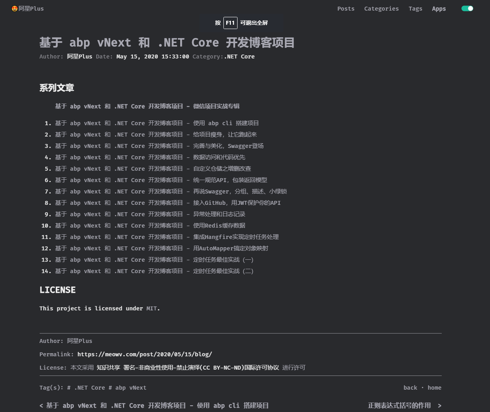
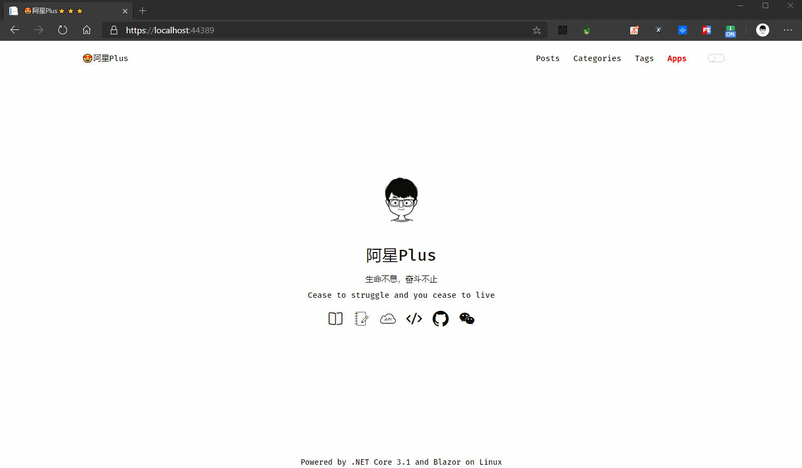

# Blazor 实战系列（五）

上一篇完成了分类标签友链的列表查询页面数据绑定，还剩下一个文章详情页的数据没有绑，现在简单的解决掉。

## 文章详情

之前已经添加了四个参数：year、month、day、name，用来组成我们最终的URL，继续添加一个参数用来接收API返回的数据。

```csharp
[Parameter]
public int year { get; set; }

[Parameter]
public int month { get; set; }

[Parameter]
public int day { get; set; }

[Parameter]
public string name { get; set; }

/// <summary>
/// URL
/// </summary>
private string url => $"/{year}/{(month >= 10 ? month.ToString() : $"0{month}")}/{(day >= 10 ? day.ToString() : $"0{day}")}/{name}/";

/// <summary>
/// 文章详情数据
/// </summary>
private ServiceResult<PostDetailDto> post;
```

然后在初始化方法`OnInitializedAsync()`中请求数据。

```csharp
/// <summary>
/// 初始化
/// </summary>
protected override async Task OnInitializedAsync()
{
    // 获取数据
    post = await Http.GetFromJsonAsync<ServiceResult<PostDetailDto>>($"/blog/post?url={url}");
}
```

现在拿到了post数据，然后在HTML中绑定即可。

```html
@if (post == null)
{
    <Loading />
}
else
{
    @if (post.Success)
    {
        var _post = post.Result;

        <article class="post-wrap">
            <header class="post-header">
                <h1 class="post-title">@_post.Title</h1>
                <div class="post-meta">
                    Author: <a itemprop="author" rel="author" href="javascript:;">@_post.Author</a>
                    <span class="post-time">
                        Date: <a href="javascript:;">@_post.CreationTime</a>
                    </span>
                    <span class="post-category">
                        Category:<a href="/category/@_post.Category.DisplayName/">@_post.Category.CategoryName</a>
                    </span>
                </div>
            </header>
            <div class="post-content" id="content">
                @((MarkupString)_post.Html)
            </div>
            <section class="post-copyright">
                <p class="copyright-item">
                    <span>Author:</span>
                    <span>@_post.Author</span>
                </p>
                <p class="copyright-item">
                    <span>Permalink:</span>
                    <span><a href="/post@_post.Url">https://meowv.com/post@_post.Url</a></span>
                </p>
                <p class="copyright-item">
                    <span>License:</span>
                    <span>本文采用<a target="_blank" href="http://creativecommons.org/licenses/by-nc-nd/4.0/"> 知识共享 署名-非商业性使用-禁止演绎(CC BY-NC-ND)国际许可协议 </a>进行许可</span>
                </p>
            </section>
            <section class="post-tags">
                <div>
                    <span>Tag(s):</span>
                    <span class="tag">
                        @if (_post.Tags.Any())
                        {
                            @foreach (var tag in _post.Tags)
                            {
                                <a href="/tag/@tag.DisplayName/"># @tag.TagName</a>
                            }
                        }
                    </span>
                </div>
                <div>
                    <a @onclick="async () => await Common.BaskAsync()">back</a>
                    <span>· </span>
                    <a href="/">home</a>
                </div>
            </section>
            <section class="post-nav">
                @if (_post.Previous != null)
                {
                    <a class="prev"
                       rel="prev"
                       @onclick="@(async () => await Common.NavigateTo($"/post{_post.Previous.Url}, true))"
                       href="/post@_post.Previous.Url">@_post.Previous.Title</a>
                }
                @if (_post.Next != null)
                {
                    <a class="next"
                       rel="next"
                       @onclick="@(async () => await Common.NavigateTo($"/post{_post.Next.Url}", true))"
                       href="/post@_post.Next.Url">
                        @_post.Next.Title
                    </a>
                }
            </section>
        </article>
    }
    else
    {
        <ErrorTip />
    }
}
```

其中有几个地方需要注意一下：

我们从post对象中取到的文章内容HTML，直接显示是不行了，需要将其解析为HTML标签，需要用到`MarkupString`。

然后页面上有一个后退按钮，这里我在`Common.cs`中写了一个方法来实现。

```csharp
/// <summary>
/// 后退
/// </summary>
/// <returns></returns>
public async Task BaskAsync()
{
    await InvokeAsync("window.history.back");
}
```

还有就是上一篇和下一篇的问题，将具体的URL传递给`NavigateTo()`方法，然后跳转过去即可。

在`Common.cs`中将之前文章创建`RenderPage()`方法修改成`NavigateTo()`。这个命名更好一点。

```csharp
/// <summary>
/// 跳转指定URL
/// </summary>
/// <param name="uri"></param>
/// <param name="forceLoad">true，绕过路由刷新页面</param>
/// <returns></returns>
public async Task NavigateTo(string url, bool forceLoad = false)
{
    _navigationManager.NavigateTo(url, forceLoad);

    await Task.CompletedTask;
}
```

现在数据算是绑定完了，但是遇到了一个大问题，就是详情页面的样式问题，因为用到了Markdown，所以之前是加载了许多JS文件来处理的。那么现在肯定行不通了，所以关于详情页的样式问题暂时搁浅，让我寻找一下好多解决方式。

现在显示是没有问题了，就是不太好看，还有关于添加文章的功能，不知道有什么好的 Markdown 编辑器可以推荐我使用。



到这里Blazor的前端展示页面已经全部弄完了，接下来开始写后台相关的页面。

## 后台首页

关于后台管理的所有页面都放在Admin文件夹下，在Pages文件夹下新建Admin文件夹，然后先添加两个组件页面：`Admin.razor`、`Auth.razor`。

`Admin.razor`为后台管理的首页入口，我们在里面直接添加几个预知的链接并设置其路由。

```html
@page "/admin"

<div class="post-wrap">
    <h2 class="post-title">-&nbsp;博客内容管理&nbsp;-</h2>
    <ul>
        <li>
            <a href="/admin/post"><h3>📝~~~ 新增文章 ~~~📝</h3></a>
        </li>
        <li>
            <a href="/admin/posts"><h3>📗~~~ 文章管理 ~~~📗</h3></a>
        </li>
        <li>
            <a href="/admin/categories"><h3>📕~~~ 分类管理 ~~~📕</h3></a>
        </li>
        <li>
            <a href="/admin/tags"><h3>📘~~~ 标签管理 ~~~📘</h3></a>
        </li>
        <li>
            <a href="/admin/friendlinks"><h3>📒~~~ 友链管理 ~~~📒</h3></a>
        </li>
    </ul>
</div>
```

里面的a标签所对应的页面还没有添加，等做到的时候再加，先手动访问这个页面看看，当成功授权后就跳到这个页面来。


## 认证授权

关于授权，因为之前在API中已经完成了基于Github的JWT模式的认证授权模式，所以这里我想做一个无感的授权功能，为什么说无感呢，因为在我使用GitHub登录的过程中，如果之前已经登录过且没有清除浏览器cookie数据，下次再登录的时候会默认直接登录成功，从而达到无感的。

实现逻辑其实也很简单，我这里用到了`Common.cs`中之前添加的公共方法设置和获取`localStorage`的方法，我会将token等信息放入`localStorage`中。

我设置的路由是：`/auth`。这个路由需要和 GitHub OAuth App 的回调地址一致，当登录成功，会回调跳到配置的页面并携带code参数。

在获取请求参数这块需要引用一个包：`Microsoft.AspNetCore.WebUtilities`，添加好后在`_Imports.razor`添加引用：`@using Meowv.Blog.BlazorApp.Shared`。

默认还是显示加载中的组件：`<Loading />`。

然后在`@code{}`中编写代码，添加页面初始化函数。

```csharp
/// <summary>
/// 初始化
/// </summary>
/// <returns></returns>
protected override async Task OnInitializedAsync()
{
    // localStorage中access_token值
    var access_token = await Common.GetStorageAsync("access_token");

    // access_token有值
    if (!string.IsNullOrEmpty(access_token))
    {
        // 获取token
        var _token = await Http.GetFromJsonAsync<ServiceResult<string>>($"/auth/token?access_token={access_token}");
        if (_token.Success)
        {
            // 将token存入localStorage
            await Common.SetStorageAsync("token", _token.Result);

            // 跳转至后台首页
            await Common.NavigateTo("/admin");
        }
        else
        {
            // access_token失效，或者请求失败的情况下，重新执行一次验证流程
            await AuthProcessAsync();
        }
    }
    else //access_token为空
    {
        await AuthProcessAsync();
    }
}
```

先去获取`localStorage`中的access_token值，肯定会有两种情况，有或者没有，然后分别去走不同的逻辑。

当access_token有值，就可以直接拿access_token去取token的值，理想情况请求成功拿到了token，这时候可以将token存到浏览器中，然后正常跳转至后台管理首页，还有就是取token失败了，失败了就有可能是access_token过期了或者出现异常情况，这时候我们不去提示错误，直接抛弃所有，重新来一遍认证授权的流程，放在一个单独的方法中`AuthProcessAsync()`。

而当access_token没值那就好办了，也去来一遍认证授权的流程即可。

验证流程`AuthProcessAsync()`的代码。

```csharp
/// <summary>
/// 验证流程
/// </summary>
/// <returns></returns>
private async Task AuthProcessAsync()
{
    // 当前URI对象
    var uri = await Common.CurrentUri();

    // 是否回调携带了code参数
    bool hasCode = QueryHelpers.ParseQuery(uri.Query).TryGetValue("code", out Microsoft.Extensions.Primitives.StringValues code);

    if (hasCode)
    {
        var access_token = await Http.GetFromJsonAsync<ServiceResult<string>>($"/auth/access_token?code={code}");
        if (access_token.Success)
        {
            // 将access_token存入localStorage
            await Common.SetStorageAsync("access_token", access_token.Result);

            var token = await Http.GetFromJsonAsync<ServiceResult<string>>($"/auth/token?access_token={access_token.Result}");
            if (token.Success)
            {
                // 将token存入localStorage
                await Common.SetStorageAsync("token", token.Result);

                // 成功认证授权，跳转至后台管理首页
                await Common.NavigateTo("/admin");
            }
            else
            {
                // 没有权限的人，回到首页去吧
                await Common.NavigateTo("/");

                // 输出提示信息
                Console.WriteLine(token.Message);
            }
        }
        else
        {
            // 出错了，回到首页去吧
            await Common.NavigateTo("/");

            // 输出提示信息
            Console.WriteLine(access_token.Message);
        }
    }
    else
    {
        // 获取第三方登录地址
        var loginAddress = await Http.GetFromJsonAsync<ServiceResult<string>>("/auth/url");

        // 跳转到登录页面
        await Common.NavigateTo(loginAddress.Result);
    }
}
```

验证流程的逻辑先获取当前URI对象，判断URI中是否携带了code参数，从而可以知道当前页面是回调的过来的还是直接请求的，获取当前URI对象放在`Common.cs`中。

```csharp
/// <summary>
/// 获取当前URI对象
/// </summary>
/// <returns></returns>
public async Task<Uri> CurrentUri()
{
    var uri = _navigationManager.ToAbsoluteUri(_navigationManager.Uri);

    return await Task.FromResult(uri);
}
```

在刚才添加的包`Microsoft.AspNetCore.WebUtilities`中为我们封装好了解析URI参数的方法。

使用`QueryHelpers.ParseQuery(...)`获取code参数的值。

当没有值的时候，直接取请求登录地址，然后如果登录成功就会跳转到携带code参数的回调页面。这样流程就又回到了 验证流程 开始的地方了。

登录成功，此时code肯定就有值了，那么直接根据code获取access_token，存入`localStorage`，正常情况拿到access_token就去生成token，然后也存入`localStorage`，成功授权可以跳到后台管理首页了。

其中如果有任何一个环节出现问题，直接跳转到网站首页去。如果授权不成功肯定是你在瞎搞(不接受任何反驳🤣🤣)，赶紧回到首页去吧。

现在流程走完，去看看效果。


GitHub在国内的情况大家知道，有时候慢甚至打不开，有时候还是挺快的，还好今天没掉链子，我遇到过好几次压根打不开的情况，获取可以针对网络不好的时候我们换成其它的验证方式，这个以后有机会再优化吧。

## 验证组件

这个时候会发现，其实我们压根不需要打开`/auth`走验证流程，直接访问`/admin`就可以进来管理首页，这是极其不合理的。那岂不是谁知道地址谁都能进来瞎搞了。所以我们可以在 Shared 文件夹下添加一个权限验证的组件：`AdminLayout.razor`。用来判断是否真的登录了。

新建一个bool类型的变量 isLogin。默认肯定是false，此时可以让页面转圈圈，使用`<Loading />`组件。当`isLogin = true`的时候我们才展示具体的HTML内容。

那么就需要用到服务端组件`RenderFragment`，他有一个固定的参数名称`ChildContent`。

判断是否登录的方法可以写在初始化方法中，这里还少了一个API，就是判断当前token的值是否合法，合法就表示已经成功执行了验证流程了。token不存在或者不合法，直接拒绝请求返回到首页去吧。

整个代码如下：

```csharp
@if (!isLogin)
{
    <Loading />
}
else
{
    @ChildContent
}

@code {
    /// <summary>
    /// 展示内容
    /// </summary>
    [Parameter]
    public RenderFragment ChildContent { get; set; }

    /// <summary>
    /// 是否登录
    /// </summary>
    private bool isLogin { get; set; }

    /// <summary>
    /// 初始化
    /// </summary>
    /// <returns></returns>
    protected override async Task OnInitializedAsync()
    {
        var token = await Common.GetStorageAsync("token");

        if (string.IsNullOrEmpty(token))
        {
            isLogin = false;

            await Common.NavigateTo("/");
        }
        else
        {
            // TODO:判断token是否合法，先默认都是正确的
            isLogin = true;
        }
    }
}
```

使用这个组件也很方便了，我们后台所有页面都引用`AdminLayout`，将展示内容传递给就行了，成功验证后就会展示HTM内容。

在`Admin.razor`中使用。

```html
@page "/admin"

<AdminLayout>
    <div class="post-wrap">
        <h2 class="post-title">-&nbsp;博客内容管理&nbsp;-</h2>
        <ul>
            <li>
                <a href="/admin/post"><h3>📝~~~ 新增文章 ~~~📝</h3></a>
            </li>
            <li>
                <a href="/admin/posts"><h3>📗~~~ 文章管理 ~~~📗</h3></a>
            </li>
            <li>
                <a href="/admin/categories"><h3>📕~~~ 分类管理 ~~~📕</h3></a>
            </li>
            <li>
                <a href="/admin/tags"><h3>📘~~~ 标签管理 ~~~📘</h3></a>
            </li>
            <li>
                <a href="/admin/friendlinks"><h3>📒~~~ 友链管理 ~~~📒</h3></a>
            </li>
        </ul>
    </div>
</AdminLayout>
```

现在清除掉浏览器缓存，去请求`/admin`试试。



完美，比较简单的实现了验证是否登录的组件。其中还有许多地方可以优化，就交给大家去自行完成了😎。
