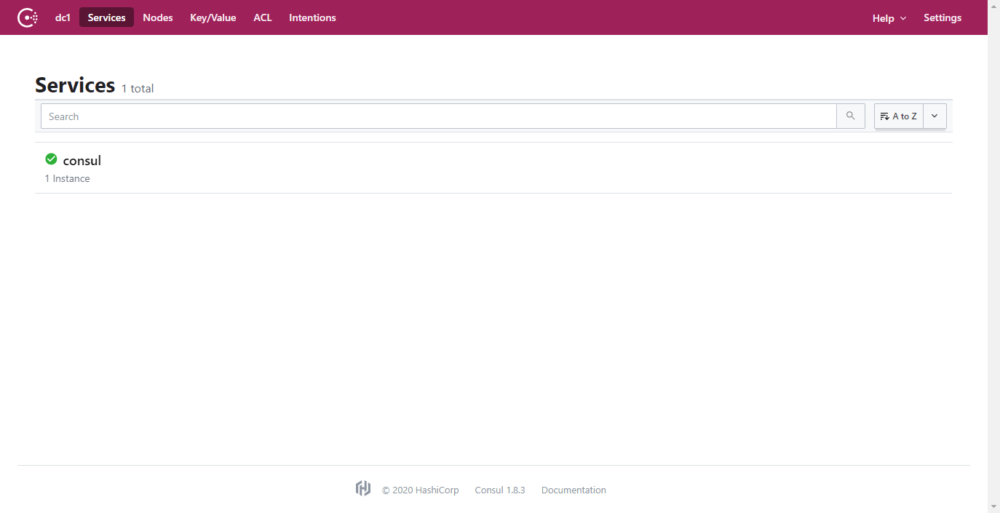
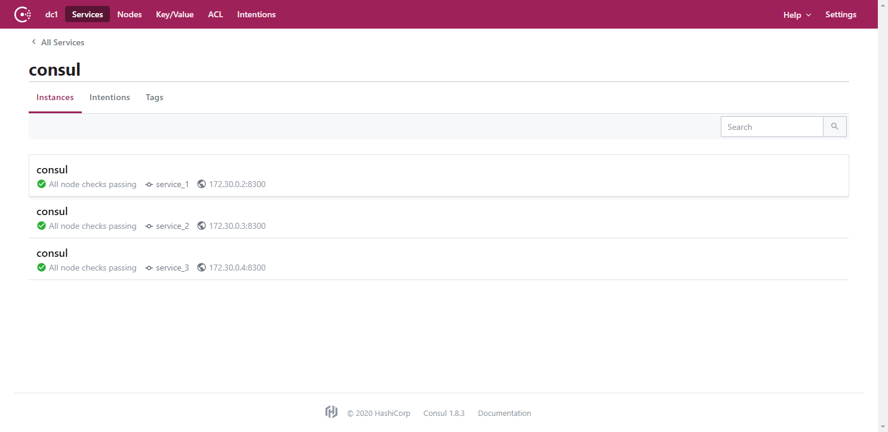
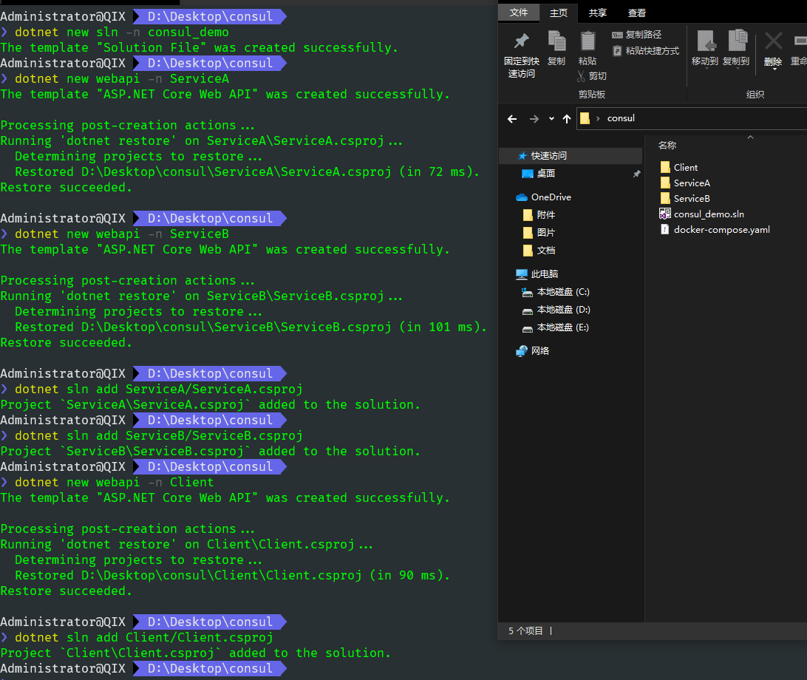
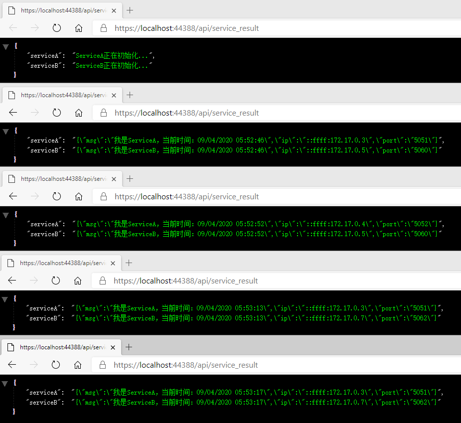

# .NET Core 使用 Consul 服务注册发现

`Consul`是一个用来实现分布式系统服务发现与配置的开源工具。它内置了服务注册与发现框架、分布一致性协议实现、健康检查、Key/Value存储、多数据中心方案，不再需要依赖其他工具，使用起来也较为简单。

- `Consul`官网：<https://www.consul.io>
- 开源地址：<https://github.com/hashicorp/consul>、<https://github.com/G-Research/consuldotnet>

## 安装

`Consul`支持各种平台的安装，安装文档：<https://www.consul.io/downloads>，为了快速使用，我这里选择用[docker方式安装](../docker/repo/consul.md)。

```yaml
version: "3"

services:
  service_1:
    image: consul
    command: agent -server -client=0.0.0.0 -bootstrap-expect=3 -node=service_1
    volumes:
      - /usr/local/docker/consul/data/service_1:/data
  service_2:
    image: consul
    command: agent -server -client=0.0.0.0 -retry-join=service_1 -node=service_2
    volumes:
      - /usr/local/docker/consul/data/service_2:/data
    depends_on:
      - service_1
  service_3:
    image: consul
    command: agent -server -client=0.0.0.0 -retry-join=service_1 -node=service_3
    volumes:
      - /usr/local/docker/consul/data/service_3:/data
    depends_on:
      - service_1
  client_1:
    image: consul
    command: agent -client=0.0.0.0 -retry-join=service_1 -ui -node=client_1
    ports:
      - 8500:8500
    volumes:
      - /usr/local/docker/consul/data/client_1:/data
    depends_on:
      - service_2
      - service_3
```

提供一个`docker-compose.yaml`，使用`docker-compose up`编排脚本启动`Consul`，如果你不熟悉，可以选择其它方式能运行`Consul`即可。



这里使用 Docker 搭建 3个 server 节点 + 1 个 client 节点，API 服务通过 client 节点进行服务注册和发现。

安装完成启动`Consul`，打开默认地址 <http://localhost:8500> 可以看到`Consul`ui界面。



## 快速使用

添加两个webapi服务，ServiceA和ServiceB，一个webapi客户端Client来调用服务。

```bash
dotnet new sln -n consul_demo

dotnet new webapi -n ServiceA
dotnet sln add ServiceA/ServiceA.csproj

dotnet new webapi -n ServiceB
dotnet sln add ServiceB/ServiceB.csproj

dotnet new webapi -n Client
dotnet sln add Client/Client.csproj
```



在项目中添加`Consul`组件包

```powershell
Install-Package Consul
```

### 服务注册

接下来在两个服务中添加必要的代码来实现将服务注册到`Consul`中。

首先将`Consul`配置信息添加到`appsettings.json`

```json
{
    "Consul": {
        "Address": "http://host.docker.internal:8500",
        "HealthCheck": "/healthcheck",
        "Name": "ServiceA",
        "Ip": "host.docker.internal"
    }
}
```

因为我们要将项目都运行在docker中，所以这里的地址要用 host.docker.internal 代替，使用 localhost 无法正常启动，如果不在 docker 中运行，这里就配置层 localhost。

添加一个扩展方法`UseConul(this IApplicationBuilder app, IConfiguration configuration, IHostApplicationLifetime lifetime)`。

```csharp
using System;
using Consul;
using Microsoft.AspNetCore.Builder;
using Microsoft.Extensions.Configuration;
using Microsoft.Extensions.Hosting;

namespace ServiceA
{
    public static class Extensions
    {
        public static IApplicationBuilder UseConul(this IApplicationBuilder app, IConfiguration configuration, IHostApplicationLifetime lifetime)
        {
            var client = new ConsulClient(options =>
            {
                options.Address = new Uri(configuration["Consul:Address"]); // Consul客户端地址
            });

            var registration = new AgentServiceRegistration
            {
                ID = Guid.NewGuid().ToString(), // 唯一Id
                Name = configuration["Consul:Name"], // 服务名
                Address = configuration["Consul:Ip"], // 服务绑定IP
                Port = Convert.ToInt32(configuration["Consul:Port"]), // 服务绑定端口
                Check = new AgentServiceCheck
                {
                    DeregisterCriticalServiceAfter = TimeSpan.FromSeconds(5), // 服务启动多久后注册
                    Interval = TimeSpan.FromSeconds(10), // 健康检查时间间隔
                    HTTP = $"http://{configuration["Consul:Ip"]}:{configuration["Consul:Port"]}{configuration["Consul:HealthCheck"]}", // 健康检查地址
                    Timeout = TimeSpan.FromSeconds(5) // 超时时间
                }
            };

            // 注册服务
            client.Agent.ServiceRegister(registration).Wait();

            // 应用程序终止时，取消服务注册
            lifetime.ApplicationStopping.Register(() =>
            {
                client.Agent.ServiceDeregister(registration.ID).Wait();
            });

            return app;
        }
    }
}
```

然后在`Startup.cs`中使用扩展方法即可。

```csharp
public void Configure(IApplicationBuilder app, IWebHostEnvironment env, IHostApplicationLifetime lifetime)
{
    ...
    app.UseConul(Configuration, lifetime);
}
```

注意，这里将`IConfiguration`和`IHostApplicationLifetime`作为参数传进来的，根据实际开发做对应的修改就可以了。

分别在ServiceA和ServiceB都完成一遍上述操作，因为不是实际项目，这里就产生的许多重复代码，在真正的项目开发过程中可以考虑放在一个单独的项目中，ServiceA和ServiceB分别引用，调用。

接着去实现健康检查接口。

```csharp
// ServiceA
using Microsoft.AspNetCore.Mvc;

namespace ServiceA.Controllers
{
    [Route("[controller]")]
    [ApiController]
    public class HealthCheckController : ControllerBase
    {
        /// <summary>
        /// 健康检查
        /// </summary>
        /// <returns></returns>
        [HttpGet]
        public IActionResult api()
        {
            return Ok();
        }
    }
}
```

```csharp
// ServiceB
using Microsoft.AspNetCore.Mvc;

namespace ServiceB.Controllers
{
    [Route("[controller]")]
    [ApiController]
    public class HealthCheckController : ControllerBase
    {
        /// <summary>
        /// 健康检查
        /// </summary>
        /// <returns></returns>
        [HttpGet]
        public IActionResult Get()
        {
            return Ok();
        }
    }
}
```

最后在ServiceA和ServiceB中都添加一个接口。

```csharp
// ServiceA
using System;
using Microsoft.AspNetCore.Mvc;
using Microsoft.Extensions.Configuration;

namespace ServiceA.Controllers
{
    [Route("api/[controller]")]
    [ApiController]
    public class ServiceAController : ControllerBase
    {
        [HttpGet]
        public IActionResult Get([FromServices] IConfiguration configuration)
        {
            var result = new
            {
                msg = $"我是{nameof(ServiceA)}，当前时间：{DateTime.Now:G}",
                ip = Request.HttpContext.Connection.LocalIpAddress.ToString(),
                port = configuration["Consul:Port"]
            };

            return Ok(result);
        }
    }
}
```

```csharp
// ServiceB
using System;
using Microsoft.AspNetCore.Mvc;
using Microsoft.Extensions.Configuration;

namespace ServiceB.Controllers
{
    [Route("api/[controller]")]
    [ApiController]
    public class ServiceBController : ControllerBase
    {
        [HttpGet]
        public IActionResult Get([FromServices] IConfiguration configuration)
        {
            var result = new
            {
                msg = $"我是{nameof(ServiceB)}，当前时间：{DateTime.Now:G}",
                ip = Request.HttpContext.Connection.LocalIpAddress.ToString(),
                port = configuration["Consul:Port"]
            };

            return Ok(result);
        }
    }
}
```

这样我们写了两个服务，ServiceA和ServiceB。都添加了健康检查接口和一个自己的服务接口，返回一段json。

我们现在来运行看看效果，可以使用任何方式，只要能启动即可，我这里选择在docker中运行，直接在 Visual Studio中对着两个解决方案右键添加，选择Docker支持，默认会帮我们自动创建好Dockfile，非常方便。

生成的Dockfile文件内容如下：

```docker
# ServiceA
FROM mcr.microsoft.com/dotnet/core/aspnet:3.1-buster-slim AS base
WORKDIR /app
EXPOSE 80
EXPOSE 443

FROM mcr.microsoft.com/dotnet/core/sdk:3.1-buster AS build
WORKDIR /src
COPY ["ServiceA/ServiceA.csproj", "ServiceA/"]
RUN dotnet restore "ServiceA/ServiceA.csproj"
COPY . .
WORKDIR "/src/ServiceA"
RUN dotnet build "ServiceA.csproj" -c Release -o /app/build

FROM build AS publish
RUN dotnet publish "ServiceA.csproj" -c Release -o /app/publish

FROM base AS final
WORKDIR /app
COPY --from=publish /app/publish .
ENTRYPOINT ["dotnet", "ServiceA.dll"]
```

```docker
# ServiceB
FROM mcr.microsoft.com/dotnet/core/aspnet:3.1-buster-slim AS base
WORKDIR /app
EXPOSE 80
EXPOSE 443

FROM mcr.microsoft.com/dotnet/core/sdk:3.1-buster AS build
WORKDIR /src
COPY ["ServiceB/ServiceB.csproj", "ServiceB/"]
RUN dotnet restore "ServiceB/ServiceB.csproj"
COPY . .
WORKDIR "/src/ServiceB"
RUN dotnet build "ServiceB.csproj" -c Release -o /app/build

FROM build AS publish
RUN dotnet publish "ServiceB.csproj" -c Release -o /app/publish

FROM base AS final
WORKDIR /app
COPY --from=publish /app/publish .
ENTRYPOINT ["dotnet", "ServiceB.dll"]
```

然后定位到项目根目录，使用命令去编译两个镜像，service_a和service_b

```bash
docker build -t service_a:dev -f ./ServiceA/Dockerfile .

docker build -t service_b:dev -f ./ServiceB/Dockerfile .
```


看到 Successfully 就成功了，通过`docker image ls`可以看到我们打包的两个镜像。


这里顺便提一句，已经可以看到我们编译的镜像，service_a和service_b了，但是还有许多名称为`<none>`的镜像，这些镜像可以不用管它，这种叫做虚悬镜像，既没有仓库名，也没有标签。是因为`docker build`导致的这种现象。由于新旧镜像同名，旧镜像名称被取消，从而出现仓库名、标签均为 `<none>` 的镜像。

一般来说，虚悬镜像已经失去了存在的价值，是可以随意删除的，可以`docker image prune`命令删除，这样镜像列表就干净多了。

最后将两个镜像service_a和service_b，分别运行三个实例。

```powershell
docker run -d -p 5050:80 --name service_a1 service_a:dev --Consul:Port="5050"
docker run -d -p 5051:80 --name service_a2 service_a:dev --Consul:Port="5051"
docker run -d -p 5052:80 --name service_a3 service_a:dev --Consul:Port="5052"

docker run -d -p 5060:80 --name service_b1 service_b:dev --Consul:Port="5060"
docker run -d -p 5061:80 --name service_b2 service_b:dev --Consul:Port="5061"
docker run -d -p 5062:80 --name service_b3 service_b:dev --Consul:Port="5062"
```


运行成功，接下来就是见证奇迹的时刻，去到`Consul`看看。


成功将两个服务注册到`Consul`，并且每个服务都有多个实例。

访问一下接口试试吧，看看能不能成功出现结果。


因为终端编码问题，导致显示乱码，这个不影响，ok，至此服务注册大功告成。

### 服务发现

搞定了服务注册，接下来演示一下如何服务发现，在Client项目中先将`Consul`地址配置到`appsettings.json`中。

```json
{
    "Consul": {
        "Address": "http://host.docker.internal:8500"
    }
}
```

然后添加一个接口，`IService.cs`，添加三个方法，分别获取两个服务的返回结果以及初始化服务的方法。

```csharp
using System.Threading.Tasks;

namespace Client
{
    public interface IService
    {
        /// <summary>
        /// 获取 ServiceA 返回数据
        /// </summary>
        /// <returns></returns>
        Task<string> GetServiceA();

        /// <summary>
        /// 获取 ServiceB 返回数据
        /// </summary>
        /// <returns></returns>
        Task<string> GetServiceB();

        /// <summary>
        /// 初始化服务
        /// </summary>
        void InitServices();
    }
}
```

实现类：`Service.cs`

```csharp
using System;
using System.Collections.Concurrent;
using System.Linq;
using System.Net.Http;
using System.Threading.Tasks;
using Consul;
using Microsoft.Extensions.Configuration;

namespace Client
{
    public class Service : IService
    {
        private readonly IConfiguration _configuration;
        private readonly ConsulClient _consulClient;

        private ConcurrentBag<string> _serviceAUrls;
        private ConcurrentBag<string> _serviceBUrls;

        private IHttpClientFactory _httpClient;

        public Service(IConfiguration configuration, IHttpClientFactory httpClient)
        {
            _configuration = configuration;

            _consulClient = new ConsulClient(options =>
            {
                options.Address = new Uri(_configuration["Consul:Address"]);
            });

            _httpClient = httpClient;
        }

        public async Task<string> GetServiceA()
        {
            if (_serviceAUrls == null)
                return await Task.FromResult("ServiceA正在初始化...");

            using var httpClient = _httpClient.CreateClient();

            var serviceUrl = _serviceAUrls.ElementAt(new Random().Next(_serviceAUrls.Count()));

            Console.WriteLine("ServiceA：" + serviceUrl);

            var result = await httpClient.GetStringAsync($"{serviceUrl}/api/servicea");

            return result;
        }

        public async Task<string> GetServiceB()
        {
            if (_serviceBUrls == null)
                return await Task.FromResult("ServiceB正在初始化...");

            using var httpClient = _httpClient.CreateClient();

            var serviceUrl = _serviceBUrls.ElementAt(new Random().Next(_serviceBUrls.Count()));

            Console.WriteLine("ServiceB：" + serviceUrl);

            var result = await httpClient.GetStringAsync($"{serviceUrl}/api/serviceb");

            return result;
        }

        public void InitServices()
        {
            var serviceNames = new string[] { "ServiceA", "ServiceB" };

            foreach (var item in serviceNames)
            {
                Task.Run(async () =>
                {
                    var queryOptions = new QueryOptions
                    {
                        WaitTime = TimeSpan.FromMinutes(5)
                    };
                    while (true)
                    {
                        await InitServicesAsync(queryOptions, item);
                    }
                });
            }

            async Task InitServicesAsync(QueryOptions queryOptions, string serviceName)
            {
                var result = await _consulClient.Health.Service(serviceName, null, true, queryOptions);

                if (queryOptions.WaitIndex != result.LastIndex)
                {
                    queryOptions.WaitIndex = result.LastIndex;

                    var services = result.Response.Select(x => $"http://{x.Service.Address}:{x.Service.Port}");

                    if (serviceName == "ServiceA")
                    {
                        _serviceAUrls = new ConcurrentBag<string>(services);
                    }
                    else if (serviceName == "ServiceB")
                    {
                        _serviceBUrls = new ConcurrentBag<string>(services);
                    }
                }
            }
        }
    }
}
```

代码就不解释了，相信都可以看懂，使用了`Random`类随机获取一个服务，关于这点可以选择更合适的负载均衡方式。

在`Startup.cs`中添加接口依赖注入、使用初始化服务等代码。

```csharp
using Microsoft.AspNetCore.Builder;
using Microsoft.AspNetCore.Hosting;
using Microsoft.Extensions.Configuration;
using Microsoft.Extensions.DependencyInjection;
using Microsoft.Extensions.Hosting;

namespace Client
{
    public class Startup
    {
        public Startup(IConfiguration configuration)
        {
            Configuration = configuration;
        }

        public IConfiguration Configuration { get; }

        public void ConfigureServices(IServiceCollection services)
        {

            services.AddControllers();

            services.AddHttpClient();

            services.AddSingleton<IService, Service>();
        }

        public void Configure(IApplicationBuilder app, IWebHostEnvironment env, IService service)
        {
            if (env.IsDevelopment())
            {
                app.UseDeveloperExceptionPage();
            }

            app.UseHttpsRedirection();

            app.UseRouting();

            app.UseAuthorization();

            app.UseEndpoints(endpoints =>
            {
                endpoints.MapControllers();
            });

            service.InitServices();
        }
    }
}
```

一切就绪，添加api访问我们的两个服务。

```csharp
using System.Threading.Tasks;
using Microsoft.AspNetCore.Mvc;

namespace Client.Controllers
{
    [Route("api")]
    [ApiController]
    public class HomeController : ControllerBase
    {
        [HttpGet]
        [Route("service_result")]
        public async Task<IActionResult> GetService([FromServices] IService service)
        {
            return Ok(new
            {
                serviceA = await service.GetServiceA(),
                serviceB = await service.GetServiceB()
            });
        }
    }
}
```

直接在Visual Studio中运行Client项目，在浏览器访问api。



大功告成，服务注册与发现，现在就算之中的某个节点挂掉，服务也可以照常运行。
