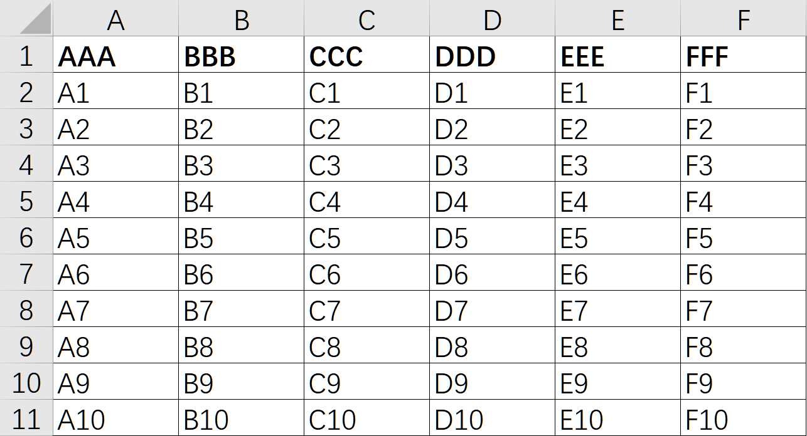

# .NET Core 中导入导出Excel

操作Excel是一个比较常见的业务场景，本篇将使用`EPPlus`简单演示一个导入导出的示例。

`EPPlus`开源地址：<https://github.com/EPPlusSoftware/EPPlus>

在项目中添加`EPPlus`组件

```PowerShell
Install-Package EPPlus
```

## 导入

先准备一个Excel文件，将其内容读取出来，并序列化成JSON字符串进行返回。



```csharp
[HttpPost]
public List<ExcelDemoDto> Import([FromForm] ImportExcelInput input)
{
    var list = new List<ExcelDemoDto>();

    using (var package = new ExcelPackage(input.ExcelFile.OpenReadStream()))
    {
        // 获取到第一个Sheet，也可以通过 Worksheets["name"] 获取指定的工作表
        var sheet = package.Workbook.Worksheets.First();

        #region 获取开始和结束行列的个数，根据个数可以做各种校验工作

        // +1 是因为第一行往往我们获取到的都是Excel的标题
        int startRowNumber = sheet.Dimension.Start.Row + 1;
        int endRowNumber = sheet.Dimension.End.Row;
        int startColumn = sheet.Dimension.Start.Column;
        int endColumn = sheet.Dimension.End.Column;

        #endregion

        // 循环获取整个Excel数据表数据
        for (int currentRow = startRowNumber; currentRow <= endRowNumber; currentRow++)
        {
            list.Add(new ExcelDemoDto
            {
                AAA = sheet.Cells[currentRow, 1].Text,
                BBB = sheet.Cells[currentRow, 2].Text,
                CCC = sheet.Cells[currentRow, 3].Text,
                DDD = sheet.Cells[currentRow, 4].Text,
                EEE = sheet.Cells[currentRow, 5].Text,
                FFF = sheet.Cells[currentRow, 6].Text
            });
        }
    }

    return list;
}

public class ExcelDemoDto
{
    public string AAA { get; set; }
    public string BBB { get; set; }
    public string CCC { get; set; }
    public string DDD { get; set; }
    public string EEE { get; set; }
    public string FFF { get; set; }
}

public class ImportExcelInput
{
    public IFormFile ExcelFile { get; set; }
}
```


## 导出

```csharp
[HttpGet]
public async Task<string> Export()
{
    using var package = new ExcelPackage();
    var worksheet = package.Workbook.Worksheets.Add("sheet1");

    var headers = new string[] { "AAA", "BBB", "CCC", "DDD", "EEE", "FFF" };
    for (int i = 0; i < headers.Length; i++)
    {
        worksheet.Cells[1, i + 1].Value = headers[i];
        worksheet.Cells[1, i + 1].Style.Font.Bold = true;
    }

    // 模拟数据
    var list = new List<ExcelDemoDto>();
    for (int i = 1; i <= 10; i++)
    {
        list.Add(new ExcelDemoDto
        {
            AAA = $"A{i}",
            BBB = $"B{i}",
            CCC = $"C{i}",
            DDD = $"D{i}",
            EEE = $"E{i}",
            FFF = $"F{i}"
        });
    }

    // 支持各种直接获取数据的方法
    // worksheet.Cells.Load*...

    int row = 2;
    foreach (var item in list)
    {
        worksheet.Cells[row, 1].Value = item.AAA;
        worksheet.Cells[row, 2].Value = item.BBB;
        worksheet.Cells[row, 3].Value = item.CCC;
        worksheet.Cells[row, 4].Value = item.DDD;
        worksheet.Cells[row, 5].Value = item.EEE;
        worksheet.Cells[row, 6].Value = item.FFF;

        row++;
    }

    // 通常做法是，将excel上传至对象存储，获取到下载链接，这里将其输出到项目根目录。
    var path = Path.Combine(Directory.GetCurrentDirectory(), $"excel.xlsx");
    await package.GetAsByteArray().DownloadAsync(path);
    return path;
}
```


