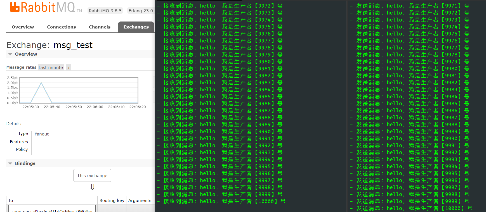

# .NET Core 下使用 RabbitMQ

## 介绍

RabbitMQ是一个开源的,基于AMQP(Advanced Message Queuing Protocol)协议的完整,可复用的企业级消息队列(Message Queue 一种应用程序与应用程序之间的一种通信方法)系统,RabbitMQ可以实现点对点,发布订阅等消息处理模式

- 官网：<https://www.rabbitmq.com/dotnet.html>
- 开源地址：<https://github.com/rabbitmq/rabbitmq-dotnet-client>

## 安装

- [docker下安装 RabbitMQ](../docker/repo/rabbitmq.md)
- [其他平台安装 RabbitMQ](https://www.rabbitmq.com/download.html)

为了开发方便，我在docker中安装了RabbitMQ，RabbitMQ安装完成后，默认端口打开地址为：`http://localhost:15672`，输入默认账号密码，guest/guest，可以看到RabbitMQ UI界面。


## 快速开始

接下来我们用RabbitMQ来完成一个比较常见的生产者和消费者模式的代码，新建两个控制台项目，`RabbitMQConsumer`和`RabbitMQProducer`。

分别在两个项目中安装组件

```PowerShell
Install-Package RabbitMQ.Client
```

在`RabbitMQProducer`生产者项目中，添加以下代码。

```csharp
using RabbitMQ.Client;
using System;
using System.Text;

namespace RabbitMQProducer
{
    class Program
    {
        static void Main(string[] args)
        {
            var factory = new ConnectionFactory()
            {
                HostName = "localhost",
                Port = 5672,
                UserName = "guest",
                Password = "guest"
            };

            using var connection = factory.CreateConnection();
            using var channel = connection.CreateModel();

            var exchange = "msg_test";

            channel.ExchangeDeclare(exchange, type: ExchangeType.Fanout);

            for (int i = 0; i < 10000; i++)
            {
                var message = $"hello，我是生产者【{i + 1}】号";
                var body = Encoding.UTF8.GetBytes(message);

                channel.BasicPublish(exchange, routingKey: "", basicProperties: null, body: body);

                Console.WriteLine($"- 发送消息：{message}");
            }
        }
    }
}
```

模拟发出10000次消息，接下来在`RabbitMQConsumer`消费者项目中接收消息，代码如下：

```csharp
using RabbitMQ.Client;
using RabbitMQ.Client.Events;
using System;
using System.Text;

namespace RabbitMQConsumer
{
    class Program
    {
        static void Main(string[] args)
        {
            var factory = new ConnectionFactory()
            {
                HostName = "localhost",
                Port = 5672,
                UserName = "guest",
                Password = "guest"
            };

            using var connection = factory.CreateConnection();
            using var channel = connection.CreateModel();

            var exchange = "msg_test";

            channel.ExchangeDeclare(exchange, type: ExchangeType.Fanout);

            var queueName = channel.QueueDeclare().QueueName;
            channel.QueueBind(queue: queueName, exchange, routingKey: "");

            Console.WriteLine("开始监听消息...");
            while (true)
            {
                var consumer = new EventingBasicConsumer(channel);

                consumer.Received += (model, ea) =>
                {
                    byte[] body = ea.Body.ToArray();
                    var message = Encoding.UTF8.GetString(body);

                    Console.WriteLine($"- 接收到消息：{message}");
                };

                channel.BasicConsume(queue: queueName, autoAck: true, consumer: consumer);
            }
        }
    }
}
```

同时启动两个看看效果。



一闪而过，速度还是挺快的，更多操作可以查看官方教程：<https://www.rabbitmq.com/getstarted.html>
