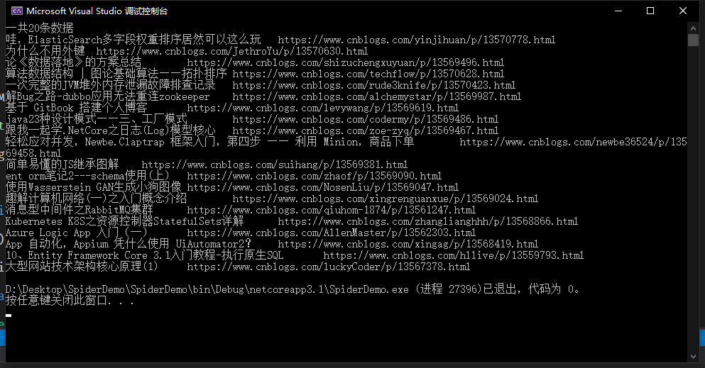
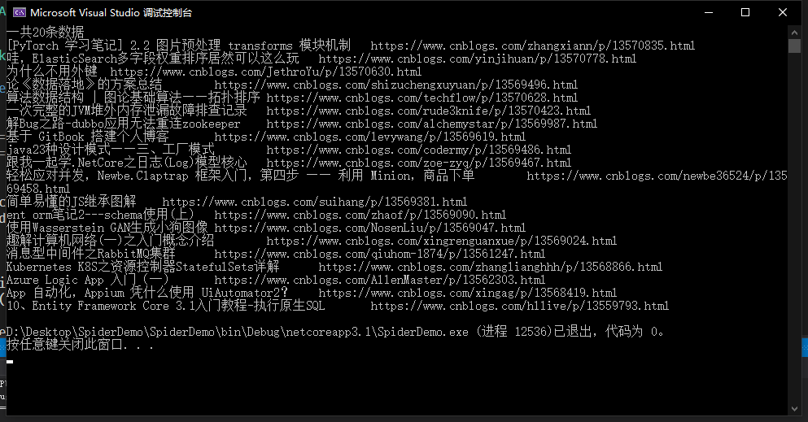
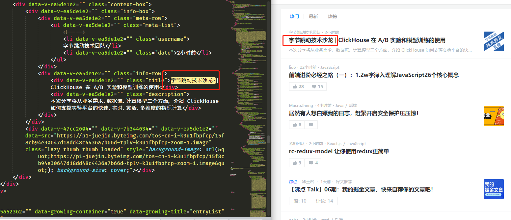
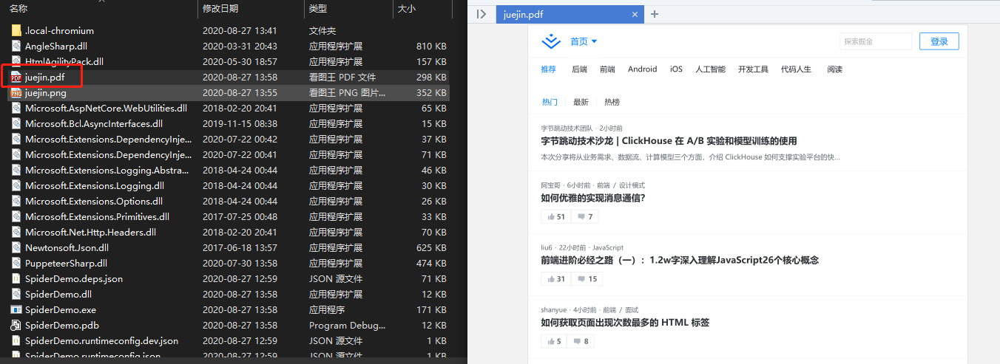

# .NET Core 下的爬虫利器

爬虫大家或多或少的都应该接触过的，爬虫有风险，抓数需谨慎。

本着研究学习的目的，记录一下在 .NET Core 下抓取数据的实际案例。爬虫代码一般具有时效性，当我们的目标发生改版升级，规则转换后我们写的爬虫代码就会失效，需要重新应对。抓取数据的主要思路就是去分析目标网站的页面逻辑，利用[`xpath`](../../python/data-extraction/xpath.md)、正则表达式等知识去解析网页拿到我们想要的数据。

本篇主要简单介绍三个组件的使用，`HtmlAgilityPack`、`AngleSharp`、`PuppeteerSharp`，前两个可以处理传统的页面，无法抓取单页应用，如果需要抓取单页应用可以使用`PuppeteerSharp`。

关于这三个组件库的实际应用可以参考一下[定时任务最佳实战](../../aspnetcore/abp-blog/task-processing-bestpractice-1.md)系列文章。

新建一个控制台项目，抓取几个站点的数据来试试，先做准备工作，添加一个`IHotNews`的接口。

```csharp
using System.Collections.Generic;
using System.Threading.Tasks;

namespace SpiderDemo
{
    public interface IHotNews
    {
        Task<IList<HotNews>> GetHotNewsAsync();
    }
}
```

`HotNews`模型，包含标题和链接

```csharp
namespace SpiderDemo
{
    public class HotNews
    {
        public string Title { get; set; }

        public string Url { get; set; }
    }
}
```

最终我们通过依赖注入的方式，将抓取到的数据展示到控制台中。

## HtmlAgilityPack

- <https://html-agility-pack.net/>
- <https://github.com/zzzprojects/html-agility-pack>

在项目中安装`HtmlAgilityPack`组件

```PowerShell
Install-Package HtmlAgilityPack
```

这里以博客园为抓取目标，我们抓取首页的文章标题和链接。

```csharp
using HtmlAgilityPack;
using System.Collections.Generic;
using System.Linq;
using System.Threading.Tasks;

namespace SpiderDemo
{
    public class HotNewsHtmlAgilityPack : IHotNews
    {
        public async Task<IList<HotNews>> GetHotNewsAsync()
        {
            var list = new List<HotNews>();

            var web = new HtmlWeb();

            var htmlDocument = await web.LoadFromWebAsync("https://www.cnblogs.com/");

            var node = htmlDocument.DocumentNode.SelectNodes("//*[@id='post_list']/article/section/div/a").ToList();

            foreach (var item in node)
            {
                list.Add(new HotNews
                {
                    Title = item.InnerText,
                    Url = item.GetAttributeValue("href", "")
                });
            }

            return list;
        }
    }
}
```

添加`HotNewsHtmlAgilityPack.cs`实现`IHotNews`接口，访问博客园网址，拿到HTML数据后，使用xpath语法解析HTML，这里主要是拿到a标签即可。

通过查看网页分析可以得到这个xpath：`//*[@id='post_list']/article/section/div/a`。

然后在`Program.cs`中注入`IHotNews`，循环遍历看看效果。

```csharp
using Microsoft.Extensions.DependencyInjection;
using System;
using System.Linq;
using System.Threading.Tasks;

namespace SpiderDemo
{
    class Program
    {
        static async Task Main(string[] args)
        {
            IServiceCollection service = new ServiceCollection();

            service.AddSingleton<IHotNews, HotNewsHtmlAgilityPack>();

            var provider = service.BuildServiceProvider().GetRequiredService<IHotNews>();

            var list = await provider.GetHotNewsAsync();

            if (list.Any())
            {
                Console.WriteLine($"一共{list.Count}条数据");

                foreach (var item in list)
                {
                    Console.WriteLine($"{item.Title}\t{item.Url}");
                }
            }
            else
            {
                Console.WriteLine("无数据");
            }
        }
    }
}
```



## AngleSharp

- <https://anglesharp.github.io/>
- <https://github.com/AngleSharp/AngleSharp>

在项目中安装`AngleSharp`组件

```PowerShell
Install-Package AngleSharp
```

同样的，新建一个`HotNewsAngleSharp.cs`也实现`IHotNews`接口，这次使用`AngleSharp`抓取。

```csharp
using AngleSharp;
using System.Collections.Generic;
using System.Threading.Tasks;

namespace SpiderDemo
{
    public class HotNewsAngleSharp : IHotNews
    {
        public async Task<IList<HotNews>> GetHotNewsAsync()
        {
            var list = new List<HotNews>();

            var config = Configuration.Default.WithDefaultLoader();
            var address = "https://www.cnblogs.com";
            var context = BrowsingContext.New(config);
            var document = await context.OpenAsync(address);

            var cellSelector = "article.post-item";
            var cells = document.QuerySelectorAll(cellSelector);

            foreach (var item in cells)
            {
                var a = item.QuerySelector("section>div>a");
                list.Add(new HotNews
                {
                    Title = a.TextContent,
                    Url = a.GetAttribute("href")
                });
            }

            return list;
        }
    }
}
```

`AngleSharp`解析数据和`HtmlAgilityPack`的方式有所不同，`AngleSharp`可以利用css规则去获取数据，用起来也是挺方便的。

在`Program.cs`中注入`IHotNews`，循环遍历看看效果。

```csharp
using Microsoft.Extensions.DependencyInjection;
using System;
using System.Linq;
using System.Threading.Tasks;

namespace SpiderDemo
{
    class Program
    {
        static async Task Main(string[] args)
        {
            IServiceCollection service = new ServiceCollection();

            service.AddSingleton<IHotNews, HotNewsAngleSharp>();

            var provider = service.BuildServiceProvider().GetRequiredService<IHotNews>();

            var list = await provider.GetHotNewsAsync();

            if (list.Any())
            {
                Console.WriteLine($"一共{list.Count}条数据");

                foreach (var item in list)
                {
                    Console.WriteLine($"{item.Title}\t{item.Url}");
                }
            }
            else
            {
                Console.WriteLine("无数据");
            }
        }
    }
}
```



## PuppeteerSharp

- <https://www.puppeteersharp.com/>
- <https://github.com/hardkoded/puppeteer-sharp>

`PuppeteerSharp`是基于`Puppeteer`的，`Puppeteer` 是一个Google 开源的NodeJS 库，它提供了一个高级API 来通过DevTools协议控制Chromium 浏览器。Puppeteer 默认以无头(Headless) 模式运行，但是可以通过修改配置运行“有头”模式。

`PuppeteerSharp`可以干很多事情，不光可以用来抓取单页应用，还可以用来生成页面PDF或者图片，可以做自动化测试等。

在项目中安装`PuppeteerSharp`组件

```PowerShell
Install-Package PuppeteerSharp
```

使用`PuppeteerSharp`第一次会帮我们在项目根目录中下载浏览器执行程序，这个取决于当前网速的快慢，建议手动下载后放在指定位置即可。

```csharp
using PuppeteerSharp;
using System.Threading.Tasks;

namespace SpiderDemo
{
    class Program
    {
        static async Task Main(string[] args)
        {
            // 下载浏览器执行程序
            await new BrowserFetcher().DownloadAsync(BrowserFetcher.DefaultRevision);

            // 创建一个浏览器执行实例
            using var browser = await Puppeteer.LaunchAsync(new LaunchOptions
            {
                Headless = true,
                Args = new string[] { "--no-sandbox" }
            });

            // 打开一个页面
            using var page = await browser.NewPageAsync();

            // 设置页面大小
            await page.SetViewportAsync(new ViewPortOptions
            {
                Width = 1920,
                Height = 1080
            });
        }
    }
}
```

上面这段代码是初始化`PuppeteerSharp`必要的代码，可以根据实际开发需要进行修改，下面以"https://juejin.im"为例，演示几个常用操作。

### 获取单页应用HTML

```csharp
...
var url = "https://juejin.im";
await page.GoToAsync(url, WaitUntilNavigation.Networkidle0);
var content = await page.GetContentAsync();
Console.WriteLine(content);
```



可以看到页面上的HTML全部被获取到了，这时候就可以利用规则解析HTML，拿到我们想要的数据了。

### 保存为图片

```csharp
...
var url = "https://juejin.im/";
await page.GoToAsync(url, WaitUntilNavigation.Networkidle0);

await page.ScreenshotAsync("juejin.png");
```


### 保存为PDF

```csharp
var url = "https://juejin.im/";
await page.GoToAsync(url, WaitUntilNavigation.Networkidle0);

await page.PdfAsync("juejin.pdf");
```



`PuppeteerSharp`的功能还有很多，比如页面注入HTML、执行JS代码等，使用的时候可以参考官网示例。
