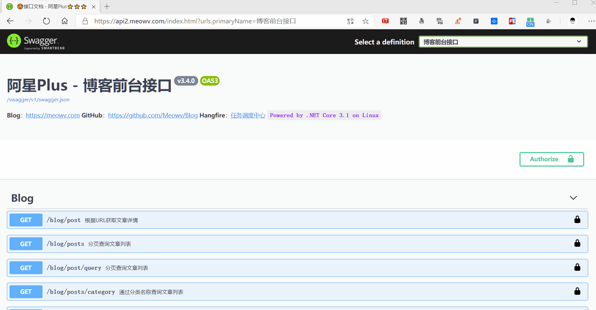
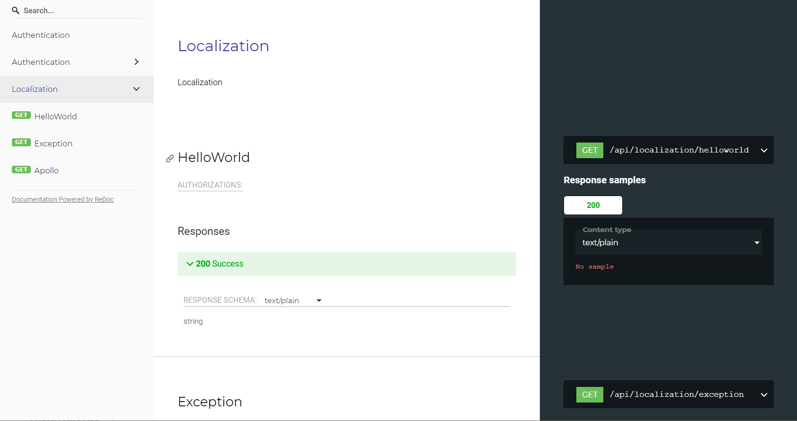

# .NET Core API文档管理组件 Swagger

`Swagger`这个优秀的开源项目相信大家都用过，不多介绍了，这里简单记录一下使用过程。

开源地址：<https://github.com/domaindrivendev/Swashbuckle.AspNetCore>

在项目中添加组件

```PowerShell
Install-Package Swashbuckle.AspNetCore
```

下面用最少的代码完成接入，在`Startup`启动项中配置。

```csharp
public void ConfigureServices(IServiceCollection services)
{
    ...
    services.AddSwaggerGen(x =>
    {
        x.SwaggerDoc("v1", new Microsoft.OpenApi.Models.OpenApiInfo
        {
            Version = "v1.0.0",
            Title = "Api",
            Description = "XXX Api"
        });
    });
    ...
}
```

```csharp
public void Configure(IApplicationBuilder app, IWebHostEnvironment env)
{
    ...

    app.UseSwagger();
    app.UseSwaggerUI(c =>
    {
        c.SwaggerEndpoint("/swagger/v1/swagger.json", "API");
    });
    ...
}
```

这样便完成了，`swagger`会自动发现我们在`controller`中写的api，默认打开页面为：`~/swagger`。

同时还可以让其支持分组展示，只需要像上面一样配置多个节点信息接口，如下面代码：

```csharp
services.AddSwaggerGen(options =>
{
    options.SwaggerDoc("v1", new Microsoft.OpenApi.Models.OpenApiInfo
    {
        Version = "v1.0.0",
        Title = "Api1",
        Description = "XXX Api1"
    });

    options.SwaggerDoc("v2", new Microsoft.OpenApi.Models.OpenApiInfo
    {
        Version = "v1.0.0",
        Title = "Api2",
        Description = "XXX Api2"
    });
});
```

```csharp
app.UseSwaggerUI(c =>
{
    c.SwaggerEndpoint("/swagger/v1/swagger.json", "API1");
    c.SwaggerEndpoint("/swagger/v2/swagger.json", "API2");
});
```

如果在控制器中不指定接口的分组名称，那么每个分组都会显示这个接口，如果需要单独指定可以使用特性`[ApiExplorerSettings(GroupName = "v1")]`这样。



如果想要显示接口的注释，模型的注释等信息，需要我们将对应的项目设置输出XML文件，并在代码中使用`options.IncludeXmlComments(xxx.xml)`即可。

下面来说一下`swagger`的一些其它功能，当我们接口开启了`JWT`方式的认证，默认`swagger`是不支持的，需要我们手动去适配一下。

需要额外添加一个组件

```PowerShell
Install-Package Swashbuckle.AspNetCore.Filters
```

```csharp
context.Services.AddSwaggerGen(options =>
{
    ...

    var security = new OpenApiSecurityScheme
    {
        Description = "<b>please enter <code>Bearer {Token}</code> for authentication.</b>",
        Name = "Authorization",
        In = ParameterLocation.Header,
        Type = SecuritySchemeType.ApiKey
    };

    options.AddSecurityDefinition("oauth2", security);
    options.AddSecurityRequirement(new OpenApiSecurityRequirement { { security, null } });
    options.OperationFilter<AddResponseHeadersFilter>();
    options.OperationFilter<AppendAuthorizeToSummaryOperationFilter>();
    options.OperationFilter<SecurityRequirementsOperationFilter>();
});
```

现在UI界面便会出现小绿锁，这样就可以很方便的在`swagger`上进行需要授权的接口调试工作了。

同时`swagger`还支持一些高级操作，比如自定义UI界面、注入JS、CSS代码，因为这个用的不是很多，实际要用的时候可以去GitHub查看使用方法。

```csharp
// Customize index.html
app.UseSwaggerUI(c =>
{
    c.IndexStream = () => GetType().Assembly.GetManifestResourceStream("CustomUIIndex.Swagger.index.html");
});

// Inject Custom CSS
app.UseSwaggerUI(c =>
{
    ...
    c.InjectStylesheet("/swagger-ui/custom.css");
}
```

这里还要说一下`swagger`的过滤器，我们可以实现`IDocumentFilter`接口，来实现自定义的接口排序，个性化接口描述，以及各种骚操作，比如我们想要隐藏某些API，当然隐藏API可以使用.NET Core 的特性`[ApiExplorerSettings(IgnoreApi = true)]`实现。

这里隐藏是指不在`swagger`UI中显示，实际接口还是存在的。

```csharp
public class SwaggerDocumentFilter : IDocumentFilter
{
    public void Apply(OpenApiDocument swaggerDoc, DocumentFilterContext context)
    {
        var tags = new List<OpenApiTag>
        {
            new OpenApiTag {
                Name = "Authentication",
                Description = "Authentication",
                ExternalDocs = new OpenApiExternalDocs { Description = "Authentication" }
            },
            new OpenApiTag {
                Name = "Localization",
                Description = "Localization",
                ExternalDocs = new OpenApiExternalDocs { Description = "Localization" }
            }
        };

        swaggerDoc.Tags = tags.OrderBy(x => x.Name).ToList();

        var apis = context.ApiDescriptions.Where(x => x.RelativePath.Contains("abp"));
        if (apis.Any())
        {
            foreach (var item in apis)
            {
                swaggerDoc.Paths.Remove("/" + item.RelativePath);
            }
        }
    }
}
```

上面这段代码，使用了abp框架搭建的项目，abp默认实现了一部分接口，如果我们不需要的话就可以使用上面的方式进行过滤。

最后一点，如果我们用了第三方框架，像上面说的abp，或者使用了动态API生成的组件，比如：[`Plus.AutoApi`](autoapi.md)，想要在`swagger`中显示出api接口，需要添加下面这句代码。

```csharp
context.Services.AddSwaggerGen(options =>
{
    ...
    options.DocInclusionPredicate((docName, description) => true);
    ...
});
```

`swagger`推出的同时还推出了一款工具`ReDoc`，下面也简单介绍一下。

`ReDoc`和`swagger`比较类似，只是一个文档展示工具，不提供接口调试的功能。

他们的使用方式基本一致，先在项目中添加一下组件

```PowerShell
Install-Package Swashbuckle.AspNetCore.ReDoc
```

在`OnApplicationInitialization`中直接添加一句配置即可。

```csharp
app.UseReDoc();
```

它支持多种参数选项，可以自行查看，默认打开页面为：`~/api-docs`，下面是他的UI界面。


