# Redis 知识点总结

## 基础篇

### 什么是 Redis

- 先解释 Redis 基本概念

Redis (Remote Dictionary Server) 是一个使用 C 语言 编写的，开源的 (BSD许可) 高性能 非关系型 (NoSQL) 的 键值对数据库。

- 简单提一下 Redis 数据结构

Redis 可以存储 键 和 不同类型数据结构值 之间的映射关系。键的类型只能是字符串，而值除了支持最 基础的五种数据类型 外，还支持一些 高级数据类型：


> 一定要说出一些高级数据结构 (当然你自己也要了解.. 下面会说到的别担心)，这样面试官的眼睛才会亮。

与传统数据库不同的是 Redis 的数据是 存在内存 中的，所以 读写速度 非常 快，因此 Redis 被广泛应用于 缓存 方向，每秒可以处理超过 10 万次读写操作，是已知性能最快的 Key-Value 数据库。另外，Redis 也经常用来做 分布式锁。

除此之外，Redis 支持事务 、持久化、LUA脚本、LRU驱动事件、多种集群方案。

### Redis 优缺点

#### 优点

- 读写性能优异， Redis能读的速度是 110000 次/s，写的速度是 81000 次/s。
- 支持数据持久化，支持 AOF 和 RDB 两种持久化方式。
- 支持事务，Redis 的所有操作都是原子性的，同时 Redis 还支持对几个操作合并后的原子性执行。
- 数据结构丰富，除了支持 string 类型的 value 外还支持 hash、set、zset、list 等数据结构。
- 支持主从复制，主机会自动将数据同步到从机，可以进行读写分离。

#### 缺点

- 数据库 容量受到物理内存的限制，不能用作海量数据的高性能读写，因此 Redis 适合的场景主要局限在较小数据量的高性能操作和运算上。
- Redis 不具备自动容错和恢复功能，主机从机的宕机都会导致前端部分读写请求失败，需要等待机器重启或者手动切换前端的 IP 才能恢复。
- 主机宕机，宕机前有部分数据未能及时同步到从机，切换 IP 后还会引入数据不一致的问题，降低了 系统的可用性。
- Redis 较难支持在线扩容，在集群容量达到上限时在线扩容会变得很复杂。为避免这一问题，运维人员在系统上线时必须确保有足够的空间，这对资源造成了很大的浪费。

### 为什么要用缓存？为什么使用 Redis

- 提一下现在 Web 应用的现状

在日常的 Web 应用对数据库的访问中，读操作的次数远超写操作，比例大概在 1:9 到 3:7，所以需要读的可能性是比写的可能大得多的。当我们使用 SQL 语句去数据库进行读写操作时，数据库就会 去磁盘把对应的数据索引取回来，这是一个相对较慢的过程。

- 使用 Redis or 使用缓存带来的优势

如果我们把数据放在 Redis 中，也就是直接放在内存之中，让服务端直接去读取内存中的数据，那么这样 速度 明显就会快上不少 (高性能)，并且会 极大减小数据库的压力 (特别是在高并发情况下)。

> 记得是 两个角度 啊.. 高性能 和 高并发..

- 也要提一下使用缓存的考虑

但是使用内存进行数据存储开销也是比较大的，限于成本 的原因，一般我们只是使用 Redis 存储一些 常用和主要的数据，比如用户登录的信息等。

一般而言在使用 Redis 进行存储的时候，我们需要从以下几个方面来考虑：

1. 业务数据常用吗？命中率如何？ 如果命中率很低，就没有必要写入缓存；
2. 该业务数据是读操作多，还是写操作多？ 如果写操作多，频繁需要写入数据库，也没有必要使用缓存；
3. 业务数据大小如何？ 如果要存储几百兆字节的文件，会给缓存带来很大的压力，这样也没有必要；

在考虑了这些问题之后，如果觉得有必要使用缓存，那么就使用它！

### 使用缓存会出现什么问题

一般来说有如下几个问题，回答思路遵照 是什么 → 为什么 → 怎么解决：

1. 缓存雪崩问题；
2. 缓存穿透问题；
3. 缓存和数据库双写一致性问题；

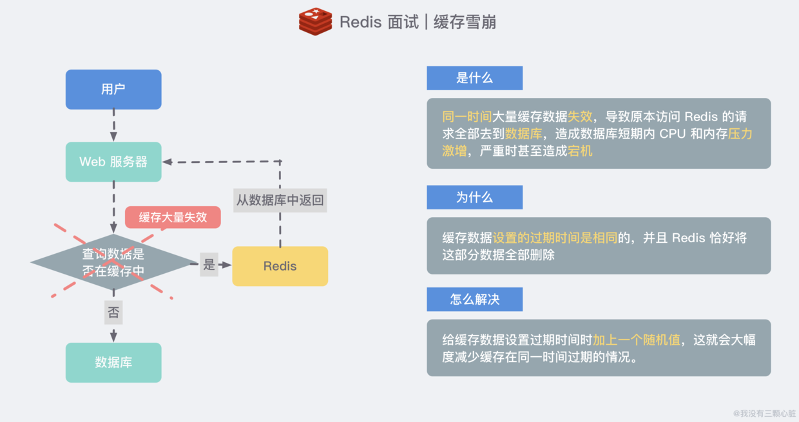

另外对于 "Redis 挂掉了，请求全部走数据库" 这样的情况，我们还可以有如下的思路：

- 事发前：实现 Redis 的高可用(主从架构 + Sentinel 或者 Redis Cluster)，尽量避免 Redis 挂掉这种情况发生。
- 事发中：万一 Redis 真的挂了，我们可以设置本地缓存(ehcache) + 限流(hystrix)，尽量避免我们的数据库被干掉(起码能保证我们的服务还是能正常工作的)
- 事发后：Redis 持久化，重启后自动从磁盘上加载数据，快速恢复缓存数据。

#### 缓存穿透问题

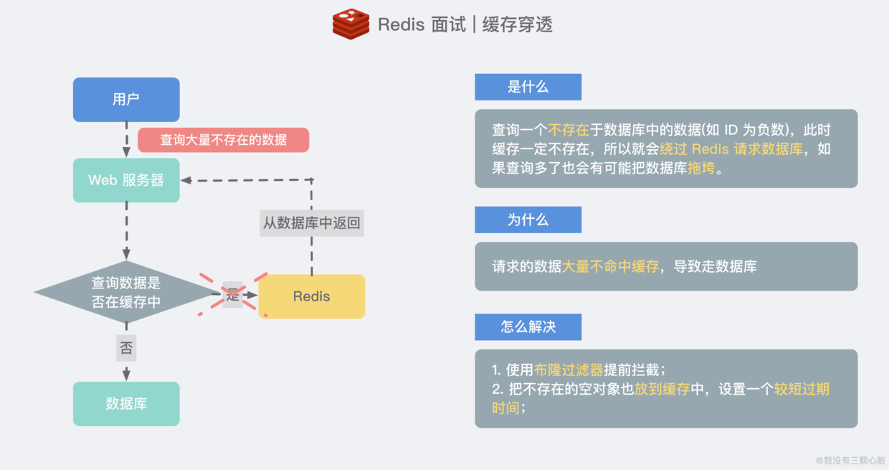

#### 缓存与数据库双写一致问题

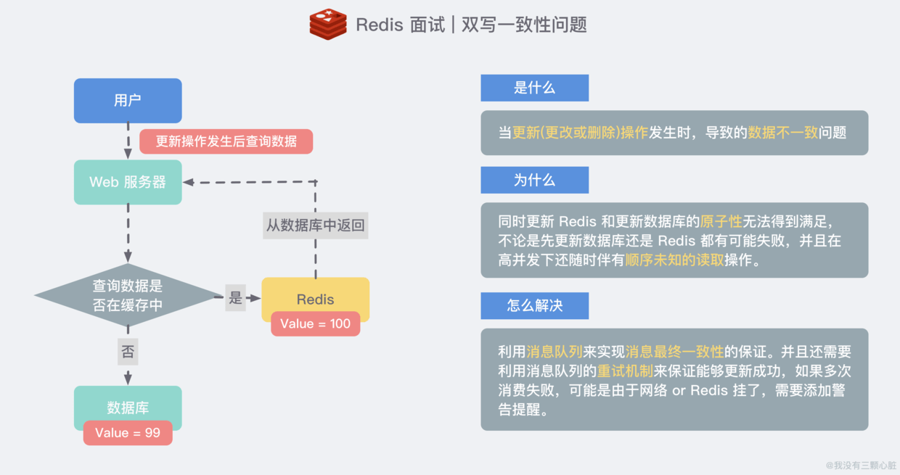

双写一致性上图还是稍微粗糙了些，你还需要知道两种方案 (先操作数据库和先操作缓存) 分别都有什么优势和对应的问题，这里不作赘述，可以参考一下下方的文章，写得非常详细。

> <https://mp.weixin.qq.com/s/3Fmv7h5p2QDtLxc9n1dp5A>

### Redis 为什么早期版本选择单线程

- 官方解释

因为 Redis 是基于内存的操作，CPU 不是 Redis 的瓶颈，Redis 的瓶颈最有可能是 机器内存的大小 或者 网络带宽。既然单线程容易实现，而且 CPU 不会成为瓶颈，那就顺理成章地采用单线程的方案了。

1. 使用单线程模型能带来更好的 可维护性，方便开发和调试；
2. 使用单线程模型也能 并发 的处理客户端的请求；(I/O 多路复用机制)
3. Redis 服务中运行的绝大多数操作的 性能瓶颈都不是 CPU；

> <https://draveness.me/whys-the-design-redis-single-thread/>

### Redis 为什么这么快

- 纯内存操作：读取不需要进行磁盘 I/O，所以比传统数据库要快上不少；(但不要有误区说磁盘就一定慢，例如 Kafka 就是使用磁盘顺序读取但仍然较快)
- 单线程，无锁竞争：这保证了没有线程的上下文切换，不会因为多线程的一些操作而降低性能；
- 多路 I/O 复用模型，非阻塞 I/O：采用多路 I/O 复用技术可以让单个线程高效的处理多个网络连接请求（尽量减少网络 IO 的时间消耗）；
- 高效的数据结构，加上底层做了大量优化：Redis 对于底层的数据结构和内存占用做了大量的优化，例如不同长度的字符串使用不同的结构体表示，HyperLogLog 的密集型存储结构等等..

## 数据结构篇

### 简述一下 Redis 常用数据结构及实现

首先在 Redis 内部会使用一个 RedisObject 对象来表示所有的 key 和 value：

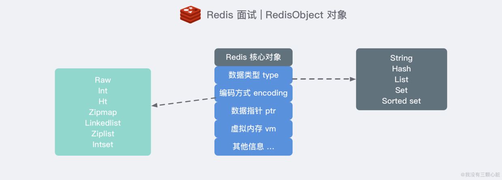

其次 Redis 为了 平衡空间和时间效率，针对 value 的具体类型在底层会采用不同的数据结构来实现，下图展示了他们之间的映射关系：(好像乱糟糟的，但至少能看清楚..)

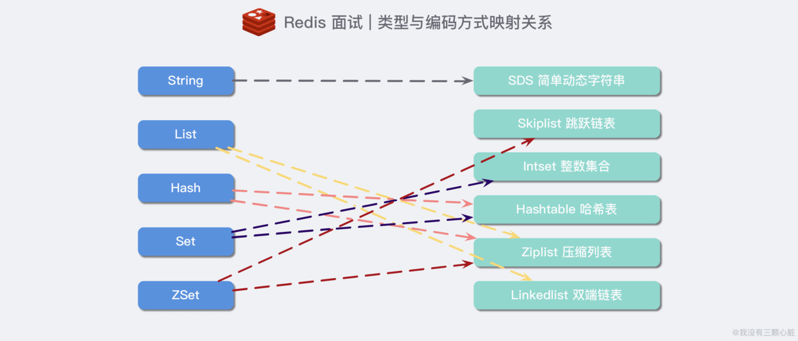

### Redis 的 SDS 和 C 中字符串相比有什么优势

C 语言使用了一个长度为 N+1 的字符数组来表示长度为 N 的字符串，并且字符数组最后一个元素总是 \0，这种简单的字符串表示方式 不符合 Redis 对字符串在安全性、效率以及功能方面的要求。

再来说 C 语言字符串的问题，这样简单的数据结构可能会造成以下一些问题：

- 获取字符串长度为 O(N) 级别的操作 → 因为 C 不保存数组的长度，每次都需要遍历一遍整个数组；
- 不能很好的杜绝 缓冲区溢出/内存泄漏 的问题 → 跟上述问题原因一样，如果执行拼接 or 缩短字符串的操作，如果操作不当就很容易造成上述问题；
- C 字符串 只能保存文本数据 → 因为 C 语言中的字符串必须符合某种编码（比如 ASCII），例如中间出现的 '\0' 可能会被判定为提前结束的字符串而识别不了；

Redis 如何解决的 | SDS 的优势

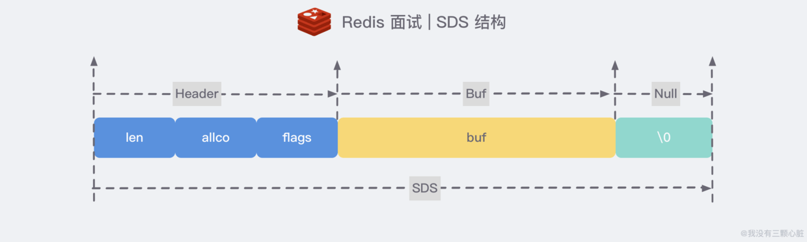

如果去看 Redis 的源码 sds.h/sdshdr 文件，你会看到 SDS 完整的实现细节，这里简单来说一下 Redis 如何解决的：

1. 多增加 len 表示当前字符串的长度：这样就可以直接获取长度了，复杂度 O(1)；
2. 自动扩展空间：当 SDS 需要对字符串进行修改时，首先借助于 len 和 alloc 检查空间是否满足修改所需的要求，如果空间不够的话，SDS 会自动扩展空间，避免了像 C 字符串操作中的覆盖情况；
3. 有效降低内存分配次数：C 字符串在涉及增加或者清除操作时会改变底层数组的大小造成重新分配，SDS 使用了 空间预分配 和 惰性空间释放 机制，简单理解就是每次在扩展时是成倍的多分配的，在缩容是也是先留着并不正式归还给 OS；
4. 二进制安全：C 语言字符串只能保存 ascii 码，对于图片、音频等信息无法保存，SDS 是二进制安全的，写入什么读取就是什么，不做任何过滤和限制；

### 字典是如何实现的？Rehash 了解吗

- 先总体聊一下 Redis 中的字典

字典是 Redis 服务器中出现最为频繁的复合型数据结构。除了 hash 结构的数据会用到字典外，整个 Redis 数据库的所有 key 和 value 也组成了一个 全局字典，还有带过期时间的 key 也是一个字典。(存储在 RedisDb 数据结构中)

- 说明字典内部结构和 rehash

Redis 中的字典相当于 Java 中的 HashMap，内部实现也差不多类似，都是通过 "数组 + 链表" 的 链地址法 来解决部分 哈希冲突，同时这样的结构也吸收了两种不同数据结构的优点。

字典结构内部包含 两个 hashtable，通常情况下只有一个 hashtable 有值，但是在字典扩容缩容时，需要分配新的 hashtable，然后进行 渐进式搬迁 (rehash)，这时候两个 hashtable 分别存储旧的和新的 hashtable，待搬迁结束后，旧的将被删除，新的 hashtable 取而代之。

- 扩缩容的条件

正常情况下，当 hash 表中 元素的个数等于第一维数组的长度时，就会开始扩容，扩容的新数组是 原数组大小的 2 倍。不过如果 Redis 正在做 bgsave(持久化命令)，为了减少内存也得过多分离，Redis 尽量不去扩容，但是如果 hash 表非常满了，达到了第一维数组长度的 5 倍了，这个时候就会 强制扩容。

当 hash 表因为元素逐渐被删除变得越来越稀疏时，Redis 会对 hash 表进行缩容来减少 hash 表的第一维数组空间占用。所用的条件是 元素个数低于数组长度的 10%，缩容不会考虑 Redis 是否在做 bgsave。

### 跳跃表是如何实现的？原理

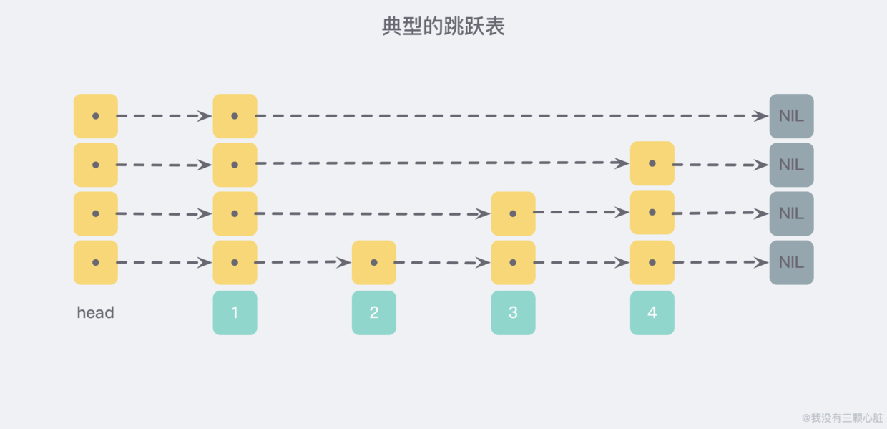

> <https://www.wmyskxz.com/2020/02/29/redis-2-tiao-yue-biao/>

### HyperLogLog 有了解吗

> <https://www.wmyskxz.com/2020/03/02/reids-4-shen-qi-de-hyperloglog-jie-jue-tong-ji-wen-ti/>

### 布隆过滤器有了解吗

> <https://www.wmyskxz.com/2020/03/11/redis-5-yi-ji-shu-ju-guo-lu-he-bu-long-guo-lu-qi/>

### GeoHash 了解吗

> <https://www.wmyskxz.com/2020/03/12/redis-6-geohash-cha-zhao-fu-jin-de-ren/>

### 压缩列表了解吗

这是 Redis 为了节约内存 而使用的一种数据结构，zset 和 hash 容器对象会在元素个数较少的时候，采用压缩列表（ziplist）进行存储。压缩列表是 一块连续的内存空间，元素之间紧挨着存储，没有任何冗余空隙。

> <https://mp.weixin.qq.com/s/nba0FUEAVRs0vi24KUoyQg>、<http://www.web-lovers.com/redis-source-ziplist.html>

### 快速列表 quicklist 了解吗

Redis 早期版本存储 list 列表数据结构使用的是压缩列表 ziplist 和普通的双向链表 linkedlist，也就是说当元素少时使用 ziplist，当元素多时用 linkedlist。但考虑到链表的附加空间相对较高，prev 和 next 指针就要占去 16 个字节（64 位操作系统占用 8 个字节），另外每个节点的内存都是单独分配，会家具内存的碎片化，影响内存管理效率。

后来 Redis 新版本（3.2）对列表数据结构进行了改造，使用 quicklist 代替了 ziplist 和 linkedlist。

> <https://zhuanlan.zhihu.com/p/102422311>

### Stream 结构有了解吗

Redis Stream 从概念上来说，就像是一个 仅追加内容 的 消息链表，把所有加入的消息都一个一个串起来，每个消息都有一个唯一的 ID 和内容，这很简单，让它复杂的是从 Kafka 借鉴的另一种概念：消费者组(Consumer Group) (思路一致，实现不同)：

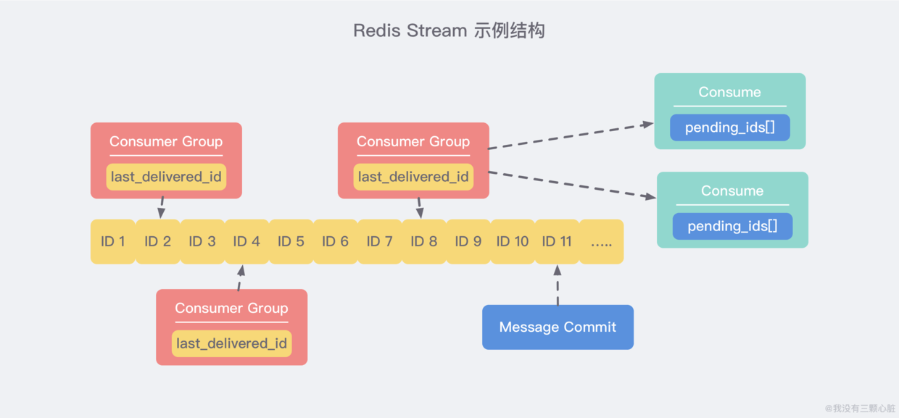

上图就展示了一个典型的 Stream 结构。每个 Stream 都有唯一的名称，它就是 Redis 的 key，在我们首次使用 xadd 指令追加消息时自动创建。我们对图中的一些概念做一下解释：

- Consumer Group：消费者组，可以简单看成记录流状态的一种数据结构。消费者既可以选择使用 XREAD 命令进行 独立消费，也可以多个消费者同时加入一个消费者组进行 组内消费。同一个消费者组内的消费者共享所有的 Stream 信息，同一条消息只会有一个消费者消费到，这样就可以应用在分布式的应用场景中来保证消息的唯一性。
- last_delivered_id：用来表示消费者组消费在 Stream 上 消费位置 的游标信息。每个消费者组都有一个 Stream 内 唯一的名称，消费者组不会自动创建，需要使用 XGROUP CREATE 指令来显式创建，并且需要指定从哪一个消息 ID 开始消费，用来初始化 last_delivered_id 这个变量。
- pending_ids：每个消费者内部都有的一个状态变量，用来表示 已经 被客户端 获取，但是 还没有 ack 的消息。记录的目的是为了 保证客户端至少消费了消息一次，而不会在网络传输的中途丢失而没有对消息进行处理。如果客户端没有 ack，那么这个变量里面的消息 ID 就会越来越多，一旦某个消息被 ack，它就会对应开始减少。这个变量也被 Redis 官方称为 PEL (Pending Entries List)。

#### Stream 消息太多怎么办

很容易想到，要是消息积累太多，Stream 的链表岂不是很长，内容会不会爆掉就是个问题了。xdel 指令又不会删除消息，它只是给消息做了个标志位。

Redis 自然考虑到了这一点，所以它提供了一个定长 Stream 功能。在 xadd 的指令提供一个定长长度 maxlen，就可以将老的消息干掉，确保最多不超过指定长度，使用起来也很简单：

```bash
> XADD mystream MAXLEN 2 * value 1
1526654998691-0
> XADD mystream MAXLEN 2 * value 2
1526654999635-0
> XADD mystream MAXLEN 2 * value 3
1526655000369-0
> XLEN mystream
(integer) 2
> XRANGE mystream - +
1) 1) 1526654999635-0
   2) 1) "value"
      2) "2"
2) 1) 1526655000369-0
   2) 1) "value"
      2) "3"
```

如果使用 MAXLEN 选项，当 Stream 的达到指定长度后，老的消息会自动被淘汰掉，因此 Stream 的大小是恒定的。目前还没有选项让 Stream 只保留给定数量的条目，因为为了一致地运行，这样的命令必须在很长一段时间内阻塞以淘汰消息。(例如在添加数据的高峰期间，你不得不长暂停来淘汰旧消息和添加新的消息)

另外使用 MAXLEN 选项的花销是很大的，Stream 为了节省内存空间，采用了一种特殊的结构表示，而这种结构的调整是需要额外的花销的。所以我们可以使用一种带有 ~ 的特殊命令：

```bash
XADD mystream MAXLEN ~ 1000 * ... entry fields here ...
```

它会基于当前的结构合理地对节点执行裁剪，来保证至少会有 1000 条数据，可能是 1010 也可能是 1030。

#### PEL 是如何避免消息丢失的

在客户端消费者读取 Stream 消息时，Redis 服务器将消息回复给客户端的过程中，客户端突然断开了连接，消息就丢失了。但是 PEL 里已经保存了发出去的消息 ID，待客户端重新连上之后，可以再次收到 PEL 中的消息 ID 列表。不过此时 xreadgroup 的起始消息 ID 不能为参数 > ，而必须是任意有效的消息 ID，一般将参数设为 0-0，表示读取所有的 PEL 消息以及自 last_delivered_id 之后的新消息。

#### 和 Kafka 对比起来呢

Redis 基于内存存储，这意味着它会比基于磁盘的 Kafka 快上一些，也意味着使用 Redis 我们 不能长时间存储大量数据。不过如果您想以 最小延迟 实时处理消息的话，您可以考虑 Redis，但是如果 消息很大并且应该重用数据 的话，则应该首先考虑使用 Kafka。

另外从某些角度来说，Redis Stream 也更适用于小型、廉价的应用程序，因为 Kafka 相对来说更难配置一些。

> <https://www.wmyskxz.com/2020/03/15/redis-8-fa-bu-ding-yue-yu-stream>

## 持久化篇

### 什么是持久化

- 先简单谈一谈是什么

Redis 的数据 全部存储 在 内存 中，如果 突然宕机，数据就会全部丢失，因此必须有一套机制来保证 Redis 的数据不会因为故障而丢失，这种机制就是 Redis 的 持久化机制，它会将内存中的数据库状态 保存到磁盘 中。

- 解释一下持久化发生了什么

我们来稍微考虑一下 Redis 作为一个 "内存数据库" 要做的关于持久化的事情。通常来说，从客户端发起请求开始，到服务器真实地写入磁盘，需要发生如下几件事情：


详细版 的文字描述大概就是下面这样：

1. 客户端向数据库 发送写命令 (数据在客户端的内存中)
2. 数据库 接收 到客户端的 写请求 (数据在服务器的内存中)
3. 数据库 调用系统 API 将数据写入磁盘 (数据在内核缓冲区中)
4. 操作系统将 写缓冲区 传输到 磁盘控控制器 (数据在磁盘缓存中)
5. 操作系统的磁盘控制器将数据 写入实际的物理媒介 中 (数据在磁盘中)

- 分析如何保证持久化安全

如果我们故障仅仅涉及到 软件层面 (该进程被管理员终止或程序崩溃) 并且没有接触到内核，那么在 上述步骤 3 成功返回之后，我们就认为成功了。即使进程崩溃，操作系统仍然会帮助我们把数据正确地写入磁盘。

如果我们考虑 停电/ 火灾 等 更具灾难性 的事情，那么只有在完成了第 5 步之后，才是安全的。

所以我们可以总结得出数据安全最重要的阶段是：步骤三、四、五，即：

1. 数据库软件调用写操作将用户空间的缓冲区转移到内核缓冲区的频率是多少？
2. 内核多久从缓冲区取数据刷新到磁盘控制器？
3. 磁盘控制器多久把数据写入物理媒介一次？
4. 注意： 如果真的发生灾难性的事件，我们可以从上图的过程中看到，任何一步都可能被意外打断丢失，所以只能 尽可能地保证 数据的安全，这对于所有数据库来说都是一样的。

我们从 第三步 开始。Linux 系统提供了清晰、易用的用于操作文件的 POSIX file API，20 多年过去，仍然还有很多人对于这一套 API 的设计津津乐道，我想其中一个原因就是因为你光从 API 的命名就能够很清晰地知道这一套 API 的用途：

```csharp
int open(const char *path, int oflag, .../*,mode_t mode */);
int close (int filedes);int remove( const char *fname );
ssize_t write(int fildes, constvoid *buf, size_t nbyte);
ssize_t read(int fildes, void *buf, size_t nbyte);
```

所以，我们有很好的可用的 API 来完成 第三步，但是对于成功返回之前，我们对系统调用花费的时间没有太多的控制权。

然后我们来说说 第四步。我们知道，除了早期对电脑特别了解那帮人 (操作系统就这帮人搞的)，实际的物理硬件都不是我们能够 直接操作 的，都是通过 操作系统调用 来达到目的的。为了防止过慢的 I/O 操作拖慢整个系统的运行，操作系统层面做了很多的努力，譬如说 上述第四步 提到的 写缓冲区，并不是所有的写操作都会被立即写入磁盘，而是要先经过一个缓冲区，默认情况下，Linux 将在 30 秒 后实际提交写入。

但是很明显，30 秒 并不是 Redis 能够承受的，这意味着，如果发生故障，那么最近 30 秒内写入的所有数据都可能会丢失。幸好 PROSIX API 提供了另一个解决方案：fsync，该命令会 强制 内核将 缓冲区 写入 磁盘，但这是一个非常消耗性能的操作，每次调用都会 阻塞等待 直到设备报告 IO 完成，所以一般在生产环境的服务器中，Redis 通常是每隔 1s 左右执行一次 fsync 操作。

到目前为止，我们了解到了如何控制 第三步 和 第四步，但是对于 第五步，我们 完全无法控制。也许一些内核实现将试图告诉驱动实际提交物理介质上的数据，或者控制器可能会为了提高速度而重新排序写操作，不会尽快将数据真正写到磁盘上，而是会等待几个多毫秒。这完全是我们无法控制的。

> 普通人简单说一下第一条就过了，如果你详细地对后面两方面 侃侃而谈，那面试官就会对你另眼相看了。

### Redis 中的两种持久化方式

#### 方式一：快照

Redis 快照 是最简单的 Redis 持久性模式。当满足特定条件时，它将生成数据集的时间点快照，例如，如果先前的快照是在 2 分钟前创建的，并且现在已经至少有 100 次新写入，则将创建一个新的快照。此条件可以由用户配置 Redis 实例来控制，也可以在运行时修改而无需重新启动服务器。快照作为包含整个数据集的单个 .rdb 文件生成。

#### 方式二：AOF

快照不是很持久。如果运行 Redis 的计算机停止运行，电源线出现故障或者您 kill -9 的实例意外发生，则写入 Redis 的最新数据将丢失。尽管这对于某些应用程序可能不是什么大问题，但有些使用案例具有充分的耐用性，在这些情况下，快照并不是可行的选择。

AOF(Append Only File - 仅追加文件) 它的工作方式非常简单：每次执行 修改内存 中数据集的写操作时，都会 记录 该操作。假设 AOF 日志记录了自 Redis 实例创建以来 所有的修改性指令序列，那么就可以通过对一个空的 Redis 实例 顺序执行所有的指令，也就是 「重放」，来恢复 Redis 当前实例的内存数据结构的状态。

#### Redis 4.0 的混合持久化

重启 Redis 时，我们很少使用 rdb 来恢复内存状态，因为会丢失大量数据。我们通常使用 AOF 日志重放，但是重放 AOF 日志性能相对 rdb 来说要慢很多，这样在 Redis 实例很大的情况下，启动需要花费很长的时间。

Redis 4.0 为了解决这个问题，带来了一个新的持久化选项——混合持久化。将 rdb 文件的内容和增量的 AOF 日志文件存在一起。这里的 AOF 日志不再是全量的日志，而是 自持久化开始到持久化结束 的这段时间发生的增量 AOF 日志，通常这部分 AOF 日志很小：

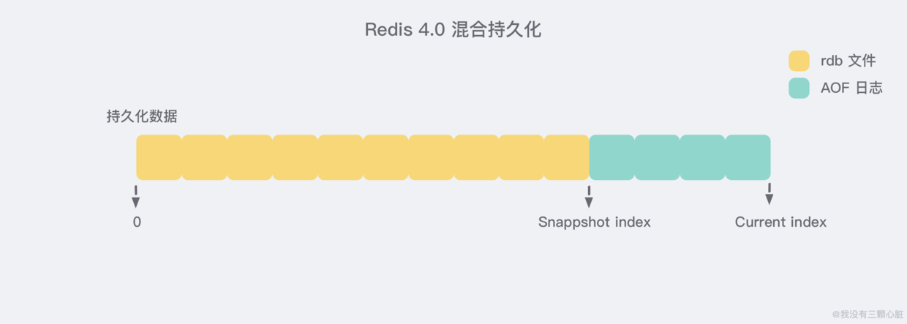

于是在 Redis 重启的时候，可以先加载 rdb 的内容，然后再重放增量 AOF 日志就可以完全替代之前的 AOF 全量文件重放，重启效率因此大幅得到提升。

> <https://www.wmyskxz.com/2020/03/13/redis-7-chi-jiu-hua-yi-wen-liao-jie/>

### RDB 和 AOF 各自有什么优缺点

#### RDB | 优点

- 只有一个文件 dump.rdb，方便持久化。
- 容灾性好，一个文件可以保存到安全的磁盘。
- 性能最大化，fork 子进程来完成写操作，让主进程继续处理命令，所以使 IO 最大化。使用单独子进程来进行持久化，主进程不会进行任何 IO 操作，保证了 Redis 的高性能
- 相对于数据集大时，比 AOF 的 启动效率 更高。

#### RDB | 缺点

- 数据安全性低。RDB 是间隔一段时间进行持久化，如果持久化之间 Redis 发生故障，会发生数据丢失。所以这种方式更适合数据要求不严谨的时候；

#### AOF | 优点

- 数据安全，aof 持久化可以配置 appendfsync 属性，有 always，每进行一次命令操作就记录到 aof 文件中一次。
- 通过 append 模式写文件，即使中途服务器宕机，可以通过 redis-check-aof 工具解决数据一致性问题。
- AOF 机制的 rewrite 模式。AOF 文件没被 rewrite 之前（文件过大时会对命令 进行合并重写），可以删除其中的某些命令（比如误操作的 flushall）

#### AOF | 缺点

- AOF 文件比 RDB 文件大，且 恢复速度慢。
- 数据集大 的时候，比 rdb 启动效率低。

### 两种方式如何选择

- 一般来说， 如果想达到足以媲美 PostgreSQL 的 数据安全性，你应该 同时使用两种持久化功能。在这种情况下，当 Redis 重启的时候会优先载入 AOF 文件来恢复原始的数据，因为在通常情况下 AOF 文件保存的数据集要比 RDB 文件保存的数据集要完整。
- 如果你非常关心你的数据， 但仍然 可以承受数分钟以内的数据丢失，那么你可以 只使用 RDB 持久化。
- 有很多用户都只使用 AOF 持久化，但并不推荐这种方式，因为定时生成 RDB 快照（snapshot）非常便于进行数据库备份， 并且 RDB 恢复数据集的速度也要比 AOF 恢复的速度要快，除此之外，使用 RDB 还可以避免 AOF 程序的 bug。
- 如果你只希望你的数据在服务器运行的时候存在，你也可以不使用任何持久化方式。

### Redis 的数据恢复

Redis 的数据恢复有着如下的优先级：

1. 如果只配置 AOF ，重启时加载 AOF 文件恢复数据；
2. 如果同时配置了 RDB 和 AOF ，启动只加载 AOF 文件恢复数据；
3. 如果只配置 RDB，启动将加载 dump 文件恢复数据。

拷贝 AOF 文件到 Redis 的数据目录，启动 redis-server AOF 的数据恢复过程：Redis 虚拟一个客户端，读取 AOF 文件恢复 Redis 命令和参数，然后执行命令从而恢复数据，这些过程主要在 loadAppendOnlyFile() 中实现。

拷贝 RDB 文件到 Redis 的数据目录，启动 redis-server 即可，因为 RDB 文件和重启前保存的是真实数据而不是命令状态和参数。

## 集群篇

### 主从同步了解吗

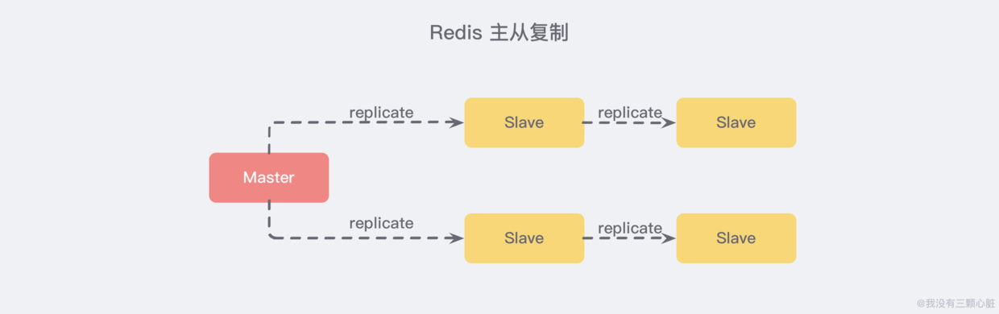

主从复制，是指将一台 Redis 服务器的数据，复制到其他的 Redis 服务器。前者称为 主节点(master)，后者称为 从节点(slave)。且数据的复制是 单向 的，只能由主节点到从节点。Redis 主从复制支持 主从同步 和 从从同步 两种，后者是 Redis 后续版本新增的功能，以减轻主节点的同步负担。

#### 主从复制主要的作用

- 数据冗余： 主从复制实现了数据的热备份，是持久化之外的一种数据冗余方式。
- 故障恢复： 当主节点出现问题时，可以由从节点提供服务，实现快速的故障恢复 (实际上是一种服务的冗余)。
- 负载均衡： 在主从复制的基础上，配合读写分离，可以由主节点提供写服务，由从节点提供读服务 （即写 Redis 数据时应用连接主节点，读 Redis 数据时应用连接从节点），分担服务器负载。尤其是在写少读多的场景下，通过多个从节点分担读负载，可以大大提高 Redis 服务器的并发量。
- 高可用基石： 除了上述作用以外，主从复制还是哨兵和集群能够实施的 基础，因此说主从复制是 Redis 高可用的基础。

#### 实现原理


为了节省篇幅，我把主要的步骤都 浓缩 在了上图中，其实也可以 简化成三个阶段：准备阶段-数据同步阶段-命令传播阶段。

> <https://www.wmyskxz.com/2020/03/17/redis-9-shi-shang-zui-qiang-ji-qun-ru-men-shi-jian-jiao-cheng/>

### 哨兵模式了解吗


上图 展示了一个典型的哨兵架构图，它由两部分组成，哨兵节点和数据节点：

- 哨兵节点： 哨兵系统由一个或多个哨兵节点组成，哨兵节点是特殊的 Redis 节点，不存储数据；
- 数据节点： 主节点和从节点都是数据节点；

在复制的基础上，哨兵实现了 自动化的故障恢复 功能，下方是官方对于哨兵功能的描述：

- 监控（Monitoring）： 哨兵会不断地检查主节点和从节点是否运作正常。
- 自动故障转移（Automatic failover）： 当 主节点 不能正常工作时，哨兵会开始 自动故障转移操作，它会将失效主节点的其中一个 从节点升级为新的主节点，并让其他从节点改为复制新的主节点。
- 配置提供者（Configuration provider）： 客户端在初始化时，通过连接哨兵来获得当前 Redis 服务的主节点地址。
- 通知（Notification）： 哨兵可以将故障转移的结果发送给客户端。

其中，监控和自动故障转移功能，使得哨兵可以及时发现主节点故障并完成转移。而配置提供者和通知功能，则需要在与客户端的交互中才能体现。

#### 新的主服务器是怎样被挑选出来的

故障转移操作的第一步 要做的就是在已下线主服务器属下的所有从服务器中，挑选出一个状态良好、数据完整的从服务器，然后向这个从服务器发送 slaveof no one 命令，将这个从服务器转换为主服务器。但是这个从服务器是怎么样被挑选出来的呢？

简单来说 Sentinel 使用以下规则来选择新的主服务器：

1. 在失效主服务器属下的从服务器当中， 那些被标记为主观下线、已断线、或者最后一次回复 PING 命令的时间大于五秒钟的从服务器都会被 淘汰。
2. 在失效主服务器属下的从服务器当中， 那些与失效主服务器连接断开的时长超过 down-after 选项指定的时长十倍的从服务器都会被 淘汰。
3. 在 经历了以上两轮淘汰之后 剩下来的从服务器中， 我们选出 复制偏移量（replication offset）最大 的那个 从服务器 作为新的主服务器；如果复制偏移量不可用，或者从服务器的复制偏移量相同，那么 带有最小运行 ID 的那个从服务器成为新的主服务器。

> <https://www.wmyskxz.com/2020/03/17/redis-9-shi-shang-zui-qiang-ji-qun-ru-men-shi-jian-jiao-cheng/>

### Redis 集群使用过吗？原理


上图 展示了 Redis Cluster 典型的架构图，集群中的每一个 Redis 节点都 互相两两相连，客户端任意 直连 到集群中的 任意一台，就可以对其他 Redis 节点进行 读写 的操作。

#### 基本原理

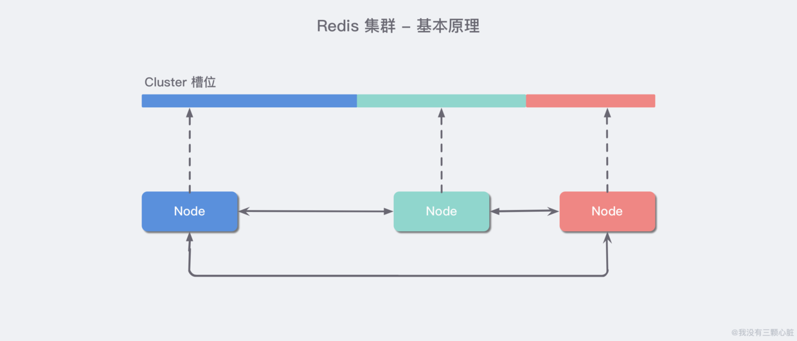

Redis 集群中内置了 16384 个哈希槽。当客户端连接到 Redis 集群之后，会同时得到一份关于这个 集群的配置信息，当客户端具体对某一个 key 值进行操作时，会计算出它的一个 Hash 值，然后把结果对 16384  求余数，这样每个 key 都会对应一个编号在 0-16383 之间的哈希槽，Redis 会根据节点数量 大致均等 的将哈希槽映射到不同的节点。

再结合集群的配置信息就能够知道这个 key 值应该存储在哪一个具体的 Redis 节点中，如果不属于自己管，那么就会使用一个特殊的 MOVED 命令来进行一个跳转，告诉客户端去连接这个节点以获取数据：

```bash
GET x-MOVED 3999 127.0.0.1:6381
```

MOVED 指令第一个参数 3999 是 key 对应的槽位编号，后面是目标节点地址，MOVED 命令前面有一个减号，表示这是一个错误的消息。客户端在收到 MOVED 指令后，就立即纠正本地的 槽位映射表，那么下一次再访问 key 时就能够到正确的地方去获取了。

#### 集群的主要作用

- 数据分区： 数据分区 (或称数据分片) 是集群最核心的功能。集群将数据分散到多个节点，一方面 突破了 Redis 单机内存大小的限制，存储容量大大增加；另一方面 每个主节点都可以对外提供读服务和写服务，大大提高了集群的响应能力。Redis 单机内存大小受限问题，在介绍持久化和主从复制时都有提及，例如，如果单机内存太大，bgsave 和 bgrewriteaof 的 fork 操作可能导致主进程阻塞，主从环境下主机切换时可能导致从节点长时间无法提供服务，全量复制阶段主节点的复制缓冲区可能溢出……
- 高可用： 集群支持主从复制和主节点的 自动故障转移 （与哨兵类似），当任一节点发生故障时，集群仍然可以对外提供服务。

### 集群中数据如何分区

Redis 采用方案三。

#### 方案一：哈希值 % 节点数

哈希取余分区思路非常简单：计算 key 的 hash 值，然后对节点数量进行取余，从而决定数据映射到哪个节点上。

不过该方案最大的问题是，当新增或删减节点时，节点数量发生变化，系统中所有的数据都需要 重新计算映射关系，引发大规模数据迁移。

#### 方案二：一致性哈希分区

一致性哈希算法将 整个哈希值空间 组织成一个虚拟的圆环，范围是 [0 - 232 - 1]，对于每一个数据，根据 key 计算 hash 值，确数据在环上的位置，然后从此位置沿顺时针行走，找到的第一台服务器就是其应该映射到的服务器：

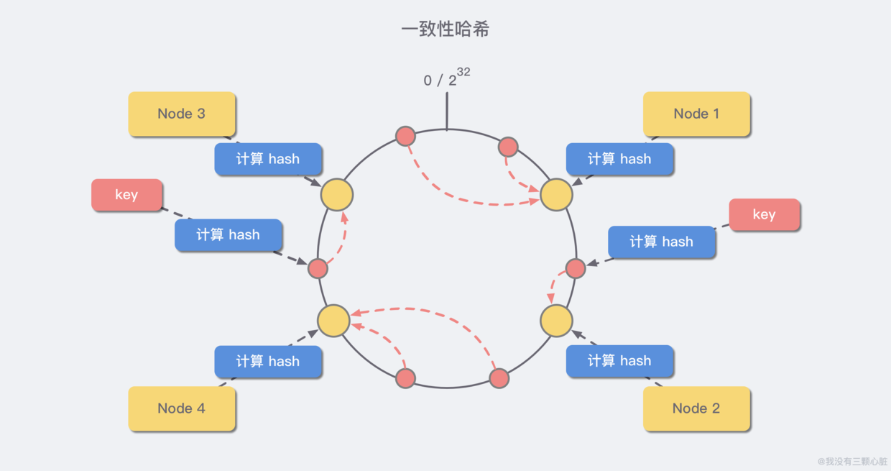

与哈希取余分区相比，一致性哈希分区将 增减节点的影响限制在相邻节点。以上图为例，如果在 node1 和 node2 之间增加 node5，则只有 node2 中的一部分数据会迁移到 node5；如果去掉 node2，则原 node2 中的数据只会迁移到 node4 中，只有 node4 会受影响。

一致性哈希分区的主要问题在于，当 节点数量较少 时，增加或删减节点，对单个节点的影响可能很大，造成数据的严重不平衡。还是以上图为例，如果去掉 node2，node4 中的数据由总数据的 1/4 左右变为 1/2 左右，与其他节点相比负载过高。

#### 方案三：带有虚拟节点的一致性哈希分区

该方案在 一致性哈希分区的基础上，引入了 虚拟节点 的概念。Redis 集群使用的便是该方案，其中的虚拟节点称为 槽（slot）。槽是介于数据和实际节点之间的虚拟概念，每个实际节点包含一定数量的槽，每个槽包含哈希值在一定范围内的数据。

在使用了槽的一致性哈希分区中，槽是数据管理和迁移的基本单位。槽 解耦 了 数据和实际节点 之间的关系，增加或删除节点对系统的影响很小。仍以上图为例，系统中有 4 个实际节点，假设为其分配 16 个槽(0-15)；

- 槽 0-3 位于 node1；4-7 位于 node2；以此类推....

如果此时删除 node2，只需要将槽 4-7 重新分配即可，例如槽 4-5 分配给 node1，槽 6 分配给 node3，槽 7 分配给 node4；可以看出删除 node2 后，数据在其他节点的分布仍然较为均衡。

### 节点之间的通信机制了解吗

集群的建立离不开节点之间的通信，例如我们在 快速体验 中刚启动六个集群节点之后通过 `redis-cli` 命令帮助我们搭建起来了集群，实际上背后每个集群之间的两两连接是通过了 `CLUSTER MEET <ip> <port>` 命令发送 MEET 消息完成的，下面我们展开详细说说。

#### 两个端口

在 哨兵系统 中，节点分为 数据节点 和 哨兵节点：前者存储数据，后者实现额外的控制功能。在 集群 中，没有数据节点与非数据节点之分：所有的节点都存储数据，也都参与集群状态的维护。为此，集群中的每个节点，都提供了两个 TCP 端口：

- 普通端口： 即我们在前面指定的端口 (7000等)。普通端口主要用于为客户端提供服务 （与单机节点类似）；但在节点间数据迁移时也会使用。
- 集群端口： 端口号是普通端口 + 10000 （10000是固定值，无法改变），如 7000 节点的集群端口为 17000。集群端口只用于节点之间的通信，如搭建集群、增减节点、故障转移等操作时节点间的通信；不要使用客户端连接集群接口。为了保证集群可以正常工作，在配置防火墙时，要同时开启普通端口和集群端口。

#### Gossip 协议

节点间通信，按照通信协议可以分为几种类型：单对单、广播、Gossip 协议等。重点是广播和 Gossip 的对比。

- 广播是指向集群内所有节点发送消息。优点 是集群的收敛速度快(集群收敛是指集群内所有节点获得的集群信息是一致的)，缺点 是每条消息都要发送给所有节点，CPU、带宽等消耗较大。
- Gossip 协议的特点是：在节点数量有限的网络中，每个节点都 “随机” 的与部分节点通信 （并不是真正的随机，而是根据特定的规则选择通信的节点），经过一番杂乱无章的通信，每个节点的状态很快会达到一致。Gossip 协议的 优点 有负载 (比广播) 低、去中心化、容错性高 (因为通信有冗余) 等；缺点 主要是集群的收敛速度慢。

#### 消息类型

集群中的节点采用 固定频率（每秒10次） 的 定时任务 进行通信相关的工作：判断是否需要发送消息及消息类型、确定接收节点、发送消息等。如果集群状态发生了变化，如增减节点、槽状态变更，通过节点间的通信，所有节点会很快得知整个集群的状态，使集群收敛。

节点间发送的消息主要分为 5 种：meet 消息、ping 消息、pong 消息、fail 消息、publish 消息。不同的消息类型，通信协议、发送的频率和时机、接收节点的选择等是不同的：

- MEET 消息： 在节点握手阶段，当节点收到客户端的 CLUSTER MEET 命令时，会向新加入的节点发送 MEET 消息，请求新节点加入到当前集群；新节点收到 MEET 消息后会回复一个 PONG 消息。
- PING 消息： 集群里每个节点每秒钟会选择部分节点发送 PING 消息，接收者收到消息后会回复一个 PONG 消息。PING 消息的内容是自身节点和部分其他节点的状态信息，作用是彼此交换信息，以及检测节点是否在线。PING 消息使用 Gossip 协议发送，接收节点的选择兼顾了收敛速度和带宽成本，具体规则如下：(1)随机找 5 个节点，在其中选择最久没有通信的 1 个节点；(2)扫描节点列表，选择最近一次收到 PONG 消息时间大于 cluster_node_timeout / 2 的所有节点，防止这些节点长时间未更新。
- PONG消息： PONG 消息封装了自身状态数据。可以分为两种：第一种 是在接到 MEET/PING 消息后回复的 PONG 消息；第二种 是指节点向集群广播 PONG 消息，这样其他节点可以获知该节点的最新信息，例如故障恢复后新的主节点会广播 PONG 消息。
- FAIL 消息： 当一个主节点判断另一个主节点进入 FAIL 状态时，会向集群广播这一 FAIL 消息；接收节点会将这一 FAIL 消息保存起来，便于后续的判断。
- PUBLISH 消息： 节点收到 PUBLISH 命令后，会先执行该命令，然后向集群广播这一消息，接收节点也会执行该 PUBLISH 命令。

### 集群数据如何存储的有了解吗

节点需要专门的数据结构来存储集群的状态。所谓集群的状态，是一个比较大的概念，包括：集群是否处于上线状态、集群中有哪些节点、节点是否可达、节点的主从状态、槽的分布……

节点为了存储集群状态而提供的数据结构中，最关键的是 clusterNode 和 clusterState 结构：前者记录了一个节点的状态，后者记录了集群作为一个整体的状态。

#### clusterNode 结构

clusterNode 结构保存了 一个节点的当前状态，包括创建时间、节点 id、ip 和端口号等。每个节点都会用一个 clusterNode 结构记录自己的状态，并为集群内所有其他节点都创建一个 clusterNode 结构来记录节点状态。

下面列举了 clusterNode 的部分字段，并说明了字段的含义和作用：

```c
typedef struct clusterNode {
    //节点创建时间
    mstime_t ctime;
    //节点id
    char name[REDIS_CLUSTER_NAMELEN];
    //节点的ip和端口号
    char ip[REDIS_IP_STR_LEN];
    int port;
    //节点标识：整型，每个bit都代表了不同状态，如节点的主从状态、是否在线、是否在握手等
    int flags;
    //配置纪元：故障转移时起作用，类似于哨兵的配置纪元
    uint64_t configEpoch;
    //槽在该节点中的分布：占用16384/8个字节，16384个比特；每个比特对应一个槽：比特值为1，则该比特对应的槽在节点中；比特值为0，则该比特对应的槽不在节点中
    unsignedchar slots[16384/8];
    //节点中槽的数量
    int numslots;
    …………
} clusterNode;
```

除了上述字段，clusterNode 还包含节点连接、主从复制、故障发现和转移需要的信息等。

#### clusterState 结构

clusterState 结构保存了在当前节点视角下，集群所处的状态。主要字段包括：

```c
typedef struct clusterState {
    //自身节点
    clusterNode *myself;
    //配置纪元
    uint64_t currentEpoch;
    //集群状态：在线还是下线
    int state;
    //集群中至少包含一个槽的节点数量
    int size;
    //哈希表，节点名称->clusterNode节点指针
    dict *nodes;
    //槽分布信息：数组的每个元素都是一个指向clusterNode结构的指针；如果槽还没有分配给任何节点，则为NULL
    clusterNode *slots[16384];
    …………
} clusterState;
```

除此之外，clusterState 还包括故障转移、槽迁移等需要的信息。

## 其他问题

### Redis 如何实现分布式锁

> <https://www.wmyskxz.com/2020/03/01/redis-3/>

### Redis 过期键的删除策略

#### 简单描述

先抛开 Redis 想一下几种可能的删除策略：

1. 定时删除:在设置键的过期时间的同时，创建一个定时器 timer). 让定时器在键的过期时间来临时，立即执行对键的删除操作。
2. 惰性删除:放任键过期不管，但是每次从键空间中获取键时，都检查取得的键是否过期，如果过期的话，就删除该键;如果没有过期，就返回该键。
3. 定期删除:每隔一段时间程序就对数据库进行一次检查，删除里面的过期键。至于要删除多少过期键，以及要检查多少个数据库，则由算法决定。

在上述的三种策略中定时删除和定期删除属于不同时间粒度的 主动删除，惰性删除属于 被动删除。

#### 三种策略都有各自的优缺点

1. 定时删除对内存使用率有优势，但是对 CPU 不友好；
2. 惰性删除对内存不友好，如果某些键值对一直不被使用，那么会造成一定量的内存浪费；
3. 定期删除是定时删除和惰性删除的折中。

#### Redis 中的实现

Reids 采用的是 惰性删除和定时删除 的结合，一般来说可以借助最小堆来实现定时器，不过 Redis 的设计考虑到时间事件的有限种类和数量，使用了无序链表存储时间事件，这样如果在此基础上实现定时删除，就意味着 O(N) 遍历获取最近需要删除的数据。

### Redis 的淘汰策略有哪些

#### Redis 有六种淘汰策略

| 策略 | 描述 |
|---|---|
| volatile-lru | 从已设置过期时间的 KV 集中优先对最近最少使用(less recently used)的数据淘汰 |
| volitile-ttl | 从已设置过期时间的 KV 集中优先对剩余时间短(time to live)的数据淘汰 |
| volitile-random | 从已设置过期时间的 KV 集中随机选择数据淘汰 |
| allkeys-lru | 从所有 KV 集中优先对最近最少使用(less recently used)的数据淘汰 |
| allKeys-random | 从所有 KV 集中随机选择数据淘汰 |
| noeviction | 不淘汰策略，若超过最大内存，返回错误信息 |

#### 4.0 版本后增加以下两种

- volatile-lfu：从已设置过期时间的数据集(`server.db[i].expires`)中挑选最不经常使用的数据淘汰
- allkeys-lfu：当内存不足以容纳新写入数据时，在键空间中，移除最不经常使用的 key

### Redis常见性能问题和解决方案

- Master 最好不要做任何持久化工作，包括内存快照和 AOF 日志文件，特别是不要启用内存快照做持久化。
- 如果数据比较关键，某个 Slave 开启 AOF 备份数据，策略为每秒同步一次。
- 为了主从复制的速度和连接的稳定性，Slave 和 Master 最好在同一个局域网内。
- 尽量避免在压力较大的主库上增加从库。
- Master 调用 BGREWRITEAOF 重写 AOF 文件，AOF 在重写的时候会占大量的 CPU 和内存资源，导致服务 load 过高，出现短暂服务暂停现象。
- 为了 Master 的稳定性，主从复制不要用图状结构，用单向链表结构更稳定，即主从关系为：Master<–Slave1<–Slave2<–Slave3…，这样的结构也方便解决单点故障问题，实现 Slave 对 Master 的替换，也即，如果 Master 挂了，可以立马启用 Slave1 做 Master，其他不变。

### 假如Redis里面有1亿个key，其中有10w个key是以某个固定的已知的前缀开头的，如何将它们全部找出来

使用 keys 指令可以扫出指定模式的 key 列表。但是要注意 keys 指令会导致线程阻塞一段时间，线上服务会停顿，直到指令执行完毕，服务才能恢复。这个时候可以使用 scan 指令，scan 指令可以无阻塞的提取出指定模式的 key 列表，但是会有一定的重复概率，在客户端做一次去重就可以了，但是整体所花费的时间会比直接用 keys 指令长。

## 参考资料

- <https://mp.weixin.qq.com/s/f9N13fnyTtnu2D5sKZiu9w>
- <https://mp.weixin.qq.com/s/DHTPSfmWTZpdTmlytzLz1g>
- <https://blog.csdn.net/ThinkWon/article/details/103522351>
- <https://juejin.im/post/6844904102850199566>
